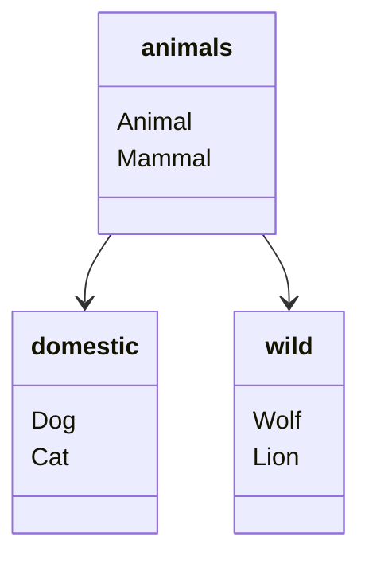
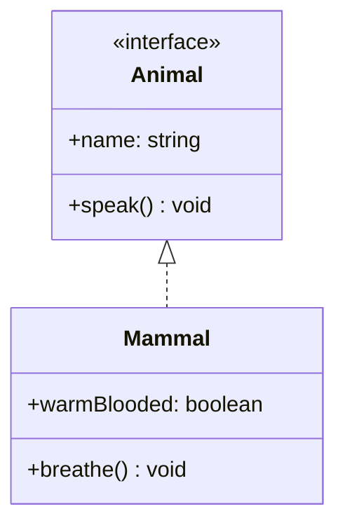
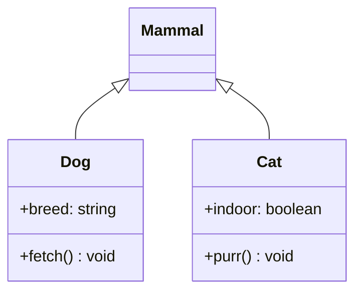
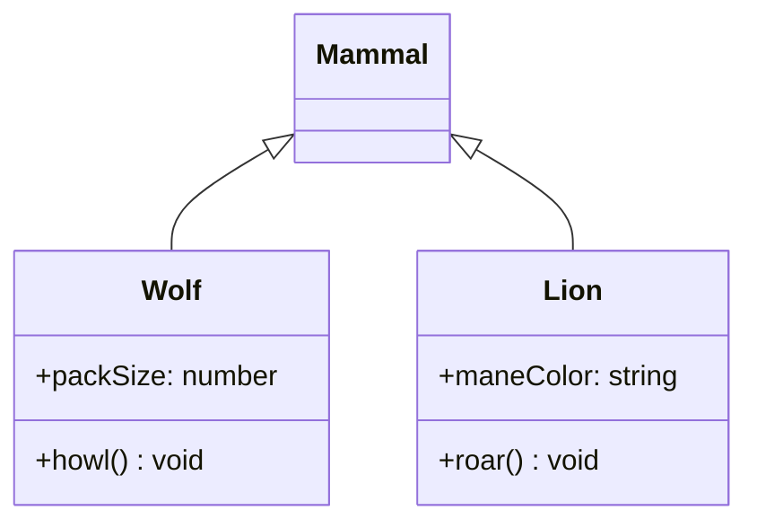

# My Package

## Architecture

### Package Overview

<!-- UML:packages:START -->

<!-- UML:packages:END -->

### animals

<!-- UML:animals:START -->

<!-- UML:animals:END -->

### domestic

<!-- UML:domestic:START -->

<!-- UML:domestic:END -->

### wild

<!-- UML:wild:START -->

<!-- UML:wild:END -->