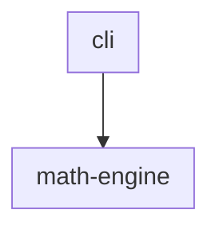
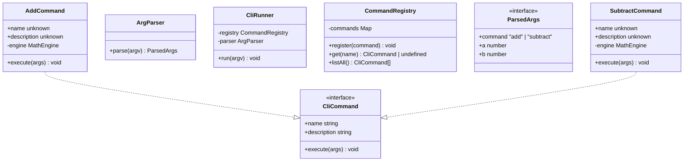
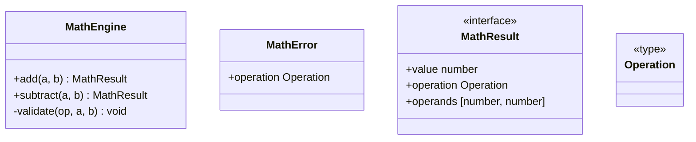

# Math CLI

A simple two-package TypeScript project demonstrating UML generation.

## Package Diagram

<!-- UML:components:START -->

<!-- UML:components:END -->

<!-- UML:components-table:START -->
| Package | Description |
|---------|-------------|
| [cli](#cli) | TBD |
| [math-engine](#math-engine) | Code for System Backend -- which enables CLI front-end access to a suite of sophisticated math functions |
<!-- UML:components-table:END -->

<!-- UML:component-details:START -->
#### cli

#### math-engine

<!-- UML:component-details:END -->
