<!-- TOC:START -->
- [Tooling for JavaScript/TypeScript/Node Projects](#tooling-for-javascripttypescriptnode-projects)
  - [Overview](#overview)
  - [Packages](#packages)
  - [Local Development](#local-development)
  - [Build Targets](#build-targets)
  - [Consistent CLI Behavior Across Tools](#consistent-cli-behavior-across-tools)
<!-- TOC:END -->

# Tooling for JavaScript/TypeScript/Node Projects

## Overview

This workspace contains JavaScript/TypeScript tooling packages for documentation-related build automation.

See [here](../README.md#design-principles) for a discussion 
of the principles which shaped the design of these tools (e.g., progressive UI disclosure, CLI as a verifier 
and never generator of code.) 

For maintainer and contributor documentation see: [here](./docs/CONTRIBUTING.md)

---

## Packages

- [`@doikayt/update-markdown-toc`](./update-markdown-toc/README.md)
  - CLI tool that auto-generates and validates Tables of Contents (TOCs) in Markdown files and checks other types of links.
- [`@doikayt/nx-graph-to-mermaid`](./nx-graph-to-mermaid/README.md)
  - NX executor plugin that generates deterministic Mermaid task-flow diagrams from `project.json` target definitions
- [`@doikayt/update-markdown-uml`](./update-markdown-uml/README.md)
  - CLI tool that generates and validates UML class and component diagrams for TypeScript source trees, injecting them into Markdown documentation files
- [`@doikayt/autogen-markdown-doc`](./autogen-markdown-doc/README.md)
  - CLI tool that bundles the above referenced packages with opinionated defaults -- enabling 
    repository-wide gen/update of TOCs, and supported diagrams (build dependencies, and UML), all via a single command. 
- [`@doikayt/tooling-core`](./tooling-core/README.md)
  - private, unpublished package containing shared logic and utilities used by the other packages in this workspace

These packages are:

- ESM-only (not dual-published for CommonJS)
- Node >= 22

## Local Development

```bash
# Simulate what CI checks — run before pushing
npx nx run build-tools-workspace:check-all

# Regenerate all docs and formatting — run before committing
npx nx run build-tools-workspace:update-all-format
```

If `check-all` passes locally, CI will pass. See [CONTRIBUTING.md](./docs/CONTRIBUTING.md)
for the full day-to-day workflow.

---

## Build Targets
The visualization below is based on [this](./project.json) NX build configuration.

```mermaid
graph TD

  check_all
  check_docs
  check_format
  check_lint
  check_mermaid
  check_toc
  check_types
  check_uml
  ci
  update_all_format
  update_docs
  update_format
  update_mermaid
  update_toc
  update_uml

  _caret_build(["^build"])
  _caret_test(["^test"])

  _xref_doikayt_autogen_markdown_doc_check_test_types{{"autogen-markdown-doc:check-test-types"}}
  _xref_doikayt_nx_graph_to_mermaid_build{{"nx-graph-to-mermaid:build"}}
  _xref_doikayt_nx_graph_to_mermaid_check_types{{"nx-graph-to-mermaid:check-types"}}
  _xref_doikayt_nx_graph_to_mermaid_lint{{"nx-graph-to-mermaid:lint"}}
  _xref_doikayt_tooling_core_check_types{{"tooling-core:check-types"}}
  _xref_doikayt_tooling_core_lint{{"tooling-core:lint"}}
  _xref_doikayt_update_markdown_toc_build{{"update-markdown-toc:build"}}
  _xref_doikayt_update_markdown_toc_check_types{{"update-markdown-toc:check-types"}}
  _xref_doikayt_update_markdown_toc_lint{{"update-markdown-toc:lint"}}
  _xref_doikayt_update_markdown_uml_build{{"update-markdown-uml:build"}}
  _xref_doikayt_update_markdown_uml_check_types{{"update-markdown-uml:check-types"}}
  _xref_doikayt_update_markdown_uml_lint{{"update-markdown-uml:lint"}}

  check_all --> check_docs
  check_all --> check_format
  check_all --> check_lint
  check_all --> check_types
  check_docs --> check_mermaid
  check_docs --> check_toc
  check_docs --> check_uml
  check_lint --> _xref_doikayt_nx_graph_to_mermaid_lint
  check_lint --> _xref_doikayt_tooling_core_lint
  check_lint --> _xref_doikayt_update_markdown_toc_lint
  check_lint --> _xref_doikayt_update_markdown_uml_lint
  check_mermaid --> _xref_doikayt_nx_graph_to_mermaid_build
  check_toc --> _caret_build
  check_types --> _xref_doikayt_autogen_markdown_doc_check_test_types
  check_types --> _xref_doikayt_nx_graph_to_mermaid_check_types
  check_types --> _xref_doikayt_tooling_core_check_types
  check_types --> _xref_doikayt_update_markdown_toc_check_types
  check_types --> _xref_doikayt_update_markdown_uml_check_types
  check_uml --> _xref_doikayt_update_markdown_uml_build
  ci --> _caret_build
  ci --> _caret_test
  ci --> check_all
  update_all_format --> update_docs
  update_all_format --> update_format
  update_docs --> update_mermaid
  update_docs --> update_toc
  update_docs --> update_uml
  update_mermaid --> _xref_doikayt_nx_graph_to_mermaid_build
  update_toc --> _xref_doikayt_update_markdown_toc_build
  update_uml --> _xref_doikayt_update_markdown_uml_build
```

<!-- NX_GRAPH:START -->

<!-- NX_GRAPH:END -->

---

## Consistent CLI Behavior Across Tools

Tools in this workspace share a consistent command-line interface and behavior model.

This includes:

- Single-file and recursive directory modes
- `--check` for CI validation
- `--verbose` and `--quiet` output control
- Deterministic traversal order
- Predictable exit codes

If you use one tool, you already understand how the others behave.

For detailed documentation of shared command-line behavior, see:

➡️ **[Common CLI Behavior](./CLI-BEHAVIOR.md)**

