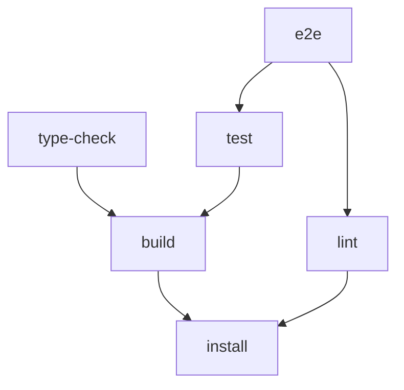
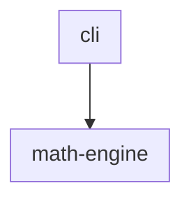

<!-- TOC:START -->
- [@datalackey/autogen-markdown-doc](#datalackeyautogen-markdown-doc)
  - [Bundled Plugins](#bundled-plugins)
  - [Installation](#installation)
  - [Usage](#usage)
    - [Update Mode (default)](#update-mode-default)
    - [Check Mode (CI Drift Detection)](#check-mode-ci-drift-detection)
  - [Tag Families](#tag-families)
  - [File Co-location Constraint](#file-co-location-constraint)
  - [Options](#options)
  - [Using Bundled Plugins Independently](#using-bundled-plugins-independently)
  - [Determinism Guarantees](#determinism-guarantees)
  - [Example](#example)
    - [Source tree](#source-tree)
    - [Generated output](#generated-output)
  - [Built With](#built-with)
  - [Packaging, Publishing, and Inter-relationship with Other Plugins](#packaging-publishing-and-inter-relationship-with-other-plugins)
  - [Contributing](#contributing)
  - [License](#license)
<!-- TOC:END -->

# @datalackey/autogen-markdown-doc

This plugin keeps documentation in sync with code. It is an 
uber-plugin that serves as a minimal-config orchestrator of the [plugins](#bundled-plugins) that it bundles.
Use this plugin directly for simple projects with a single Markdown file — typically README.md.  
The Markdown file may contain any combination of auto-generated Table of Contents, UML component diagrams, and 
NX build task-graph diagrams (where each auto-generated block has corresponding [injection markers](#tag-families).) 

Place the relevant injection markers where you want them in your Markdown file, then run the tool. 
UML and NX graph plugins activate only when their markers are present;
TOC is always invoked when any markers are found at all.
Sections without recognized markers are left untouched.

For CI, check mode detects drift: any generated section that has fallen out of sync 
with its source causes a non-zero exit, making it straightforward to gate a 
PR pipeline that requires documentation correctness.

When your project outgrows these defaults and needs features such as recursive traversal through 
your repo, custom source paths, or per-plugin flags — invoke the bundled plugins directly.


---

## Bundled Plugins

This package orchestrates three focused plugins:

- [`@datalackey/update-markdown-toc`](../update-markdown-toc/README.md) — generates Tables of Contents
- [`@datalackey/update-markdown-uml`](../update-markdown-uml/README.md) — generates UML component diagrams from TypeScript source
- [`@datalackey/nx-graph-to-mermaid`](../nx-graph-to-mermaid/README.md) — generates Mermaid task-graph diagrams from `project.json`

Each plugin is activated only when its tag family is present in the target file:

| Plugin | Activates when… |
|---|---|
| `update-markdown-toc` | Always (when any markers are found at all) |
| `nx-graph-to-mermaid` | `NX_GRAPH:START` / `NX_GRAPH:END` markers present **and** `project.json` exists in the same directory |
| `update-markdown-uml` | Any of the three `UML:*` marker pairs are present |

If the target file contains none of the three tag families, the tool warns and exits cleanly.

---

## Installation

```bash
npm i -D @datalackey/autogen-markdown-doc
```

---

## Usage

### Update Mode (default)

Applies all tag transformations in-place:

```bash
# Target README.md in the current directory (default)
npx autogen-markdown-doc

# Explicit subcommand
npx autogen-markdown-doc update

# Specify a different file
npx autogen-markdown-doc update docs/OVERVIEW.md

# Skip specific UML source packages
npx autogen-markdown-doc update --exclude-components legacy,deprecated
```

---

### Check Mode (CI Drift Detection)

Validates tags without writing any files. Plugins run in sequence (NX → UML → TOC)
and exit immediately on the first drift detected:

```bash
# Check README.md in current directory
npx autogen-markdown-doc check

# Check a specific file
npx autogen-markdown-doc check docs/OVERVIEW.md
```

---

## Tag Families

| Plugin | Marker pair(s) |
|---|---|
| `update-markdown-toc` | `<!-- TOC:START -->` … `<!-- TOC:END -->` |
| `update-markdown-uml` | `<!-- UML:components:START -->` … `<!-- UML:components:END -->`<br>`<!-- UML:components-table:START -->` … `<!-- UML:components-table:END -->`<br>`<!-- UML:component-details:START -->` … `<!-- UML:component-details:END -->` |
| `nx-graph-to-mermaid` | `<!-- NX_GRAPH:START -->` … `<!-- NX_GRAPH:END -->` |

---

## File Co-location Constraint

The target Markdown file must reside in the same directory as any required plugin inputs:

| Plugin | Required co-resident |
|---|---|
| `nx-graph-to-mermaid` | `project.json` |
| `update-markdown-uml` | `src/` directory |

If your layout differs — recursive traversal, custom source paths, or per-plugin flags — invoke
the underlying packages directly (see [Using Bundled Plugins Independently](#using-bundled-plugins-independently)).

---

## Options

| Option | Description |
|---|---|
| `--exclude-components <pkg1,pkg2>` | Forwarded to UML generation only; leaf directory names under `src/` to skip |
| `-q`, `--quiet` | Suppress all non-error output, including the "no markers" warning |
| `-d`, `--debug` | Print debug diagnostics to stderr |
| `-h`, `--help` | Show this help message and exit (exit 0) |

---

## Using Bundled Plugins Independently

_When your project outgrows the defaults — recursive traversal, custom source paths,
per-plugin flags — invoke the underlying packages directly:_

```bash
# TOC only — single file
npx update-markdown-toc README.md

# TOC — recursive (all .md files under a folder)
npx update-markdown-toc --recursive docs/

# UML diagrams only
npx update-markdown-uml README.md

# UML with exclusions
npx update-markdown-uml --exclude-components legacy,deprecated README.md

# CI drift check — single plugin
npx update-markdown-toc --check README.md
npx update-markdown-uml --check README.md

# CI drift check — uber-bundle
npx autogen-markdown-doc check
```

> **Note:** `nx-graph-to-mermaid` is an NX executor and has no standalone CLI.
> To invoke it independently, configure a target in your `project.json` using the
> `@datalackey/nx-graph-to-mermaid:run` executor. See the
> [nx-graph-to-mermaid README](../nx-graph-to-mermaid/README.md) for details.

---

## Determinism Guarantees

- Running `update` twice produces no changes on the second run.
- `check` passes immediately after `update`.

Conceptually:

```
check(update(file)) === TRUE     # check should always pass after one update cycle
```

Pro Tip: Plugins run in order **NX → UML → TOC**. UML runs before TOC so that
component headings it injects (e.g. `#### cli`, `#### math-engine`) are already
present by the time TOC scans the file — convergence happens in a single `update`
pass. NX runs first because its output does not inject headings that TOC picks up,
so its position relative to UML does not affect convergence.
(Don't worry if this doesn't make sense yet!)

---

## Example

[This folder](./tests/e2e/fixtures/math-cli-nx) contains a sample project that
demonstrates the tool's output with all three content-generation features active.

The sample project is a simple two-component TypeScript app: a `cli` layer that
delegates computation to a `math-engine` layer. It also ships a `project.json`
declaring a six-target NX build pipeline with parallelism and branching.

Running the sample is a good way to see the full output. Copy/paste the code
below to clone it, install the published plugin, and run it.

To view the rendered mermaid diagrams, use VSCode's built-in Markdown preview, or
push to GitHub and view in the browser.

```bash
rm -rf /tmp/run-autogen-sample
mkdir /tmp/run-autogen-sample
cp -r javascript/autogen-markdown-doc/tests/e2e/fixtures/math-cli-nx/* /tmp/run-autogen-sample/
cd /tmp/run-autogen-sample/
npm install
npx autogen-markdown-doc
echo Load the README file into your favorite Markdown viewer. Enjoy the injected content.
```

### Source tree

A two-component project with a six-target build pipeline:

```
src/
  cli/
    AddCommand.ts
    ArgParser.ts
    CliCommand.ts
    CliRunner.ts
    CommandRegistry.ts
    ParsedArgs.ts
    SubtractCommand.ts
  math-engine/
    MathEngine.ts
    MathError.ts
    MathResult.ts
    Operation.ts
project.json          ← NX build pipeline (install → build/lint → type-check/test → e2e)
README.md             ← target file with all three tag families
```

`cli` imports from `math-engine`. `math-engine` has no dependency on `cli`.

### Generated output

**Table of contents** — injected between `TOC:START` / `TOC:END` markers:

```
- [Math CLI](#math-cli)
  - [Build Pipeline](#build-pipeline)
  - [Component Diagram](#component-diagram)
  - [Components Table](#components-table)
  - [Component Details](#component-details)
  - [Usage](#usage)
```

**NX task-graph** — injected between `NX_GRAPH:START` / `NX_GRAPH:END` markers.
The `project.json` declares six targets with `install → build/lint → type-check/test → e2e`
dependencies, producing a branching pipeline diagram:



**Component overview** — injected between `UML:components:START` / `UML:components:END` markers.
One subgraph per component; arrows show import direction:



**Components table** — injected between `UML:components-table:START` / `UML:components-table:END`
markers. Descriptions are read from `_COMPONENT_INFO.md` files in each component directory:

| Component | Description |
|-----------|-------------|
| cli | Command-line interface layer that parses arguments and dispatches math operations to the math-engine component |
| math-engine | Code for System Backend -- which enables CLI front-end access to a suite of sophisticated math functions |

**Class diagrams** — one per component, injected between `UML:component-details:START` /
`UML:component-details:END` markers. See
[update-markdown-uml README](../update-markdown-uml/README.md#generated-output) for the
full class-diagram output.

---

## Built With

For the full workspace tech stack see: [TECH-STACK.md](../TECH-STACK.md)

---

## Packaging, Publishing, and Inter-relationship with Other Plugins

This package is one component of a small ecosystem of JavaScript tooling plugins maintained
as individual npm packages in this repository.
The versioning and release of these packages is governed by a coordinated release policy, and
the packages adhere to common design and architectural principles described [here](../README.md).

---

## Contributing 

For development setup, build workflow, and release procedures (including how to
trigger a publish via Changesets), see [CONTRIBUTING.md](../docs/CONTRIBUTING.md).

---

## License

MIT
