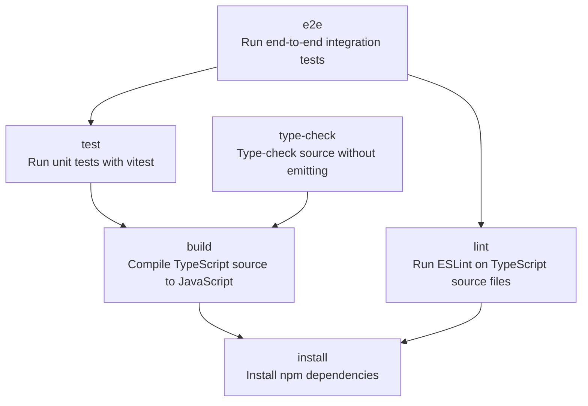
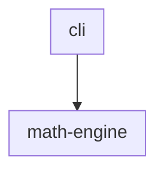
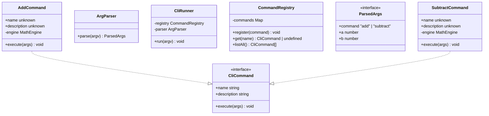
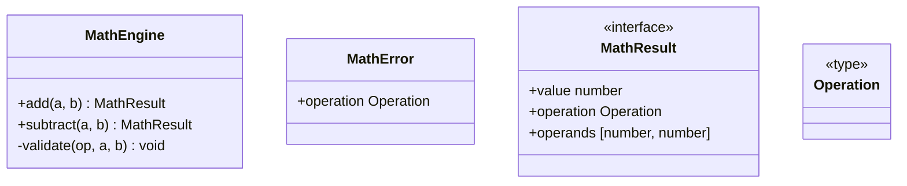

<!-- TOC:START -->
- [Math CLI](#math-cli)
  - [Build Pipeline](#build-pipeline)
  - [Component Diagram](#component-diagram)
  - [Components Table](#components-table)
  - [Component Details](#component-details)
  - [Usage](#usage)
<!-- TOC:END -->

# Math CLI

A simple two-component TypeScript project demonstrating all three autogen-markdown-doc
content-generation features: table of contents, NX build-pipeline diagram, and UML
class diagrams.

## Build Pipeline

<!-- NX_GRAPH:START -->

<!-- NX_GRAPH:END -->

## Component Diagram

<!-- UML:components:START -->

<!-- UML:components:END -->

## Components Table

<!-- UML:components-table:START -->
| Package | Description |
|---------|-------------|
| [cli](#cli) | Command-line interface layer that parses arguments and dispatches math operations to the math-engine component |
| [math-engine](#math-engine) | Code for System Backend -- which enables CLI front-end access to a suite of sophisticated math functions |
<!-- UML:components-table:END -->

## Component Details

<!-- UML:component-details:START -->
#### cli


#### math-engine

<!-- UML:component-details:END -->

## Usage

```bash
node dist/cli/CliRunner.js add 3 4
```

