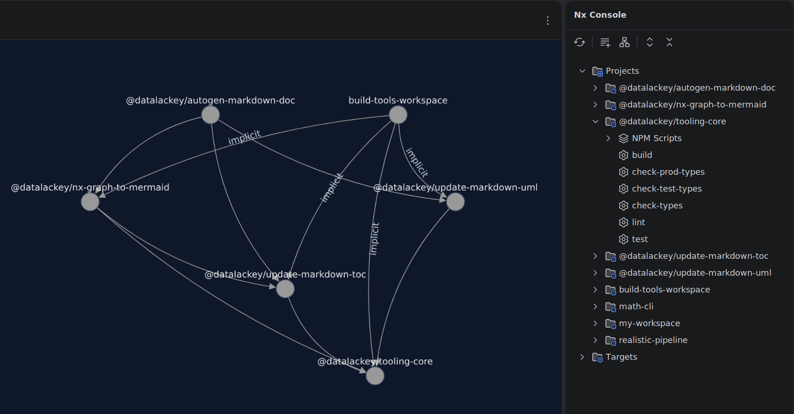

<!-- TOC:START -->
- [Contributing to JavaScript/TypeScript/Node Packages](#contributing-to-javascripttypescriptnode-packages)
  - [First-Time Setup](#first-time-setup)
  - [Overall Repo Structure Model](#overall-repo-structure-model)
  - [Build Pipeline](#build-pipeline)
    - [In-IDE Build Target Execution and Visualization](#in-ide-build-target-execution-and-visualization)
  - [Package Naming Policy](#package-naming-policy)
  - [Development and Release Engineering Workflows](#development-and-release-engineering-workflows)
    - [Day to Day Development (Package Level) Overview](#day-to-day-development-package-level-overview)
    - [Integration Testing Overview (Via Combined All-in-One Plugin)](#integration-testing-overview-via-combined-all-in-one-plugin)
    - [Packaging and Release Steps Overview](#packaging-and-release-steps-overview)
  - [Packaging and Release Workflow Details](#packaging-and-release-workflow-details)
    - [1. Ensure a Clean Working Tree](#1-ensure-a-clean-working-tree)
    - [2. Run All Tests](#2-run-all-tests)
    - [3. Create a Changeset](#3-create-a-changeset)
    - [4. Push — CI does the rest](#4-push--ci-does-the-rest)
    - [5. Verify Release](#5-verify-release)
  - [Versioning Tiers](#versioning-tiers)
    - [Forcing a specific bump level](#forcing-a-specific-bump-level)
    - [Suppressing a release](#suppressing-a-release)
  - [Handling `changeset status` Errors](#handling-changeset-status-errors)
  - [Development Flow](#development-flow)
  - [How the Automated Release Pipeline Works](#how-the-automated-release-pipeline-works)
  - [Verifying a Release](#verifying-a-release)
  - [Rules](#rules)
  - [Publishing as NPM Packages](#publishing-as-npm-packages)
  - [Sideways Version Bump Policy](#sideways-version-bump-policy)
  - [Design Principles](#design-principles)
<!-- TOC:END -->

# Contributing to JavaScript/TypeScript/Node Packages

This guide is targeted to project contributors and covers first-time setup, day-to-day development, and release engineering
for the packages in the `javascript/` workspace.

For the top-level contributor entry point see: [CONTRIBUTING.md](../../CONTRIBUTING.md)

---

## First-Time Setup
```bash
mkdir -p ~/workspace && cd ~/workspace
git clone git@github.com:datalackey/build-tools.git
cd build-tools/javascript
npm ci
npx nx run-many -t build,test --skip-nx-cache
```

---

## Overall Repo Structure Model

This repo has three layers:
- The repository root, which contains [CI configuration](../../.github/workflows/javascript-ci.yml) and 
  resides one level up from the `javascript` folder.
- The secondary (platform) level where the `javascript/` folder lives. Each folder at this level is specific
  to some given platform (e.g.: JVM, Javascript, Python, etc.) and contains
  appropriate release packaging and publishing configuration for that platform.
- The lowest level consists of individually consumable packages for plugins and tools.
```
 Repo Root                       ← CI configuration
│
├── javascript/                  ← npm workspace + Changesets control plane
│   ├── update-markdown-toc/
│   ├── nx-graph-to-mermaid/
│   └── autogen-markdown-doc/
│
├── jvm/                         ← possible future JVM workspace
│
└── python/                      ← possible future Python workspace
```

---

## Build Pipeline

This workspace uses **NX** (See: https://nx.dev/) to orchestrate builds and tests across packages.
NX owns the full execution graph — do not use `npm run build` or `npm test` at the workspace
root to drive builds. Use NX directly:
```bash
npx nx run-many -t build,test --skip-nx-cache
```

Dependency ordering is declared in each package's `project.json` via `dependsOn`.


### In-IDE Build Target Execution and Visualization

- Intellij
  - Install the Nx Console plugin to obtain a graphical overview of this mono-repo as well as a hierarchical
    navivation tree that lets you select and execute build targets in IDEA.
  <p align="center">
  
</p>


- Other IDEs 
  - This is an excercise for the reader (but please contribut a documentation PR if you find something good!)


---

## Package Naming Policy

Every publishable package under `javascript/` must use the `@datalackey/` scope as its name —
consistently in **both** `package.json` (`name`) and `project.json` (`name`). For example:
`@datalackey/update-markdown-toc`.

**Exception:** the top-level orchestrating workspace (`javascript/` itself) is unscoped:
- `package.json` name: `build-tools`
- `project.json` name: `build-tools-workspace`

Rationale:

- The `@datalackey/` scope identifies packages that are actually published to npm. The workspace
  root is never published — it only orchestrates builds, tests, and releases for the packages
  beneath it — so giving it a scoped name would misleadingly imply it's a consumable artifact.
- Keeping `package.json` and `project.json` names identical for each package avoids ambiguity
  in NX target references (e.g. `dependsOn` entries, `prepack` scripts). A mismatch between the
  two means some commands must reference the package by its unscoped NX project name while
  others must use the scoped npm name — an easy source of broken `dependsOn` graphs and
  copy-paste errors when authoring new targets.

---

## Development and Release Engineering Workflows

### Day to Day Development (Package Level) Overview

Work from inside the individual package folder:
```bash
cd javascript/nx-graph-to-mermaid   # or whichever package you're working on
```

Typical workflow:
```bash
# 1. Edit source files, then build and test — only changed projects rebuild
npx nx run-many -t build,test

# Force a full rebuild of everything (e.g. after a branch switch):
npx nx run-many -t build,test --skip-nx-cache

# 2. Regenerate docs and reformat code before committing
cd javascript   # must run from workspace root
npx nx run build-tools-workspace:update-all

# 3. Stage and commit
git add .
git commit -m "fix(my-package): what changed and why"

# 4. Verify everything passes before pushing (catches lint, types, format drift)
npx nx run build-tools-workspace:check-all

# 5. Pull any CI-generated version bump commits before pushing
git pull --rebase

git push
```

> **Why `git pull --rebase` before push?**
> The release pipeline commits version bumps back to `main` (`chore: release [skip ci]`).
> If a release ran since your last pull, your local branch is behind and git will reject
> the push. `--rebase` keeps history linear and avoids noisy merge commits.

> **`update-all` vs `check-all`:**
> `update-all` auto-fixes docs and formatting — run it before committing.
> `check-all` validates everything including lint (which cannot be auto-fixed) — run it
> before pushing. Lint errors must be fixed manually.

---

### Integration Testing Overview (Via Combined All-in-One Plugin)

Cross-package testing lives inside:
```
javascript/autogen-markdown-doc
```

The wrapper package is the integration boundary.
It imports and composes the base plugins, and adds a little bit of its own functionality.

Cross-package tests belong there — not at workspace root.

---

### Packaging and Release Steps Overview

Release mechanics must run from:
```
cd javascript
```

Because that is where we have:

- `package.json` (with `"workspaces"`)
- `.changeset/`
- release configuration

Release commands:

- `npx changeset`
- `npx changeset version`
- `npx changeset publish`

---

## Packaging and Release Workflow Details

### 1. Ensure a Clean Working Tree
```
git status
```

There should be no uncommitted changes.

---

### 2. Run All Tests
```bash
cd javascript
npx nx run-many -t build,test --skip-nx-cache
```

STOP if any test fails.

---

### 3. Create a Changeset
```
npx changeset
```

You will be prompted to:

- Select affected packages (use up/down arrow to choose and spacebar to (un)select)
- Choose semver bump (patch / minor / major)
- Provide release summary

Commit:
```
git add .changeset
git commit -m "chore: add changeset" .
```

---

### 4. Push — CI does the rest

Commit your changes and push:
```sh
git add .
git commit -m "fix(my-package): description of what changed"
git push origin main
```

CI will automatically:
- Inspect the git log since the last release tag and derive the semver bump from your commit prefix (see [Versioning tiers](#versioning-tiers) below)
- Run `npx changeset version` (bumps all package versions, updates changelogs)
- Commit the version bumps back to main with `[skip ci]`
- Run `npx changeset publish` to publish all packages to npm

You can follow progress in
[GitHub Actions](https://github.com/datalackey/build-tools/actions/workflows/javascript-ci.yml).

---

### 5. Verify Release

After the workflow completes, confirm:

- GitHub Actions run succeeded
- Packages appear on npm
- Versions match expected coordinated bump

---

## Versioning Tiers

All packages in this workspace version together in lockstep (see
[Sideways Version Bump Policy](#sideways-version-bump-policy)); the bump level is derived from
conventional commit prefixes by `scripts/auto-changeset.sh`. The tier definitions and the
commit-prefix → bump mapping are canonical policy — see [Versioning Tiers][rp-tiers].

### Forcing a specific bump level

Run `npx changeset` from `javascript/` before pushing — the auto-generation script defers to a
handwritten changeset. Details: [Forcing a Specific Bump Level][rp-forcing].

### Suppressing a release

Run `npx changeset add --empty` from `javascript/` and commit the empty changeset.
Details: [Suppressing a Release][rp-suppressing].

---

## Handling `changeset status` Errors

The error, what it means, and both resolution paths (real vs empty changeset) are canonical
policy — see [Handling `changeset status` Errors][rp-status]. In build-tools, run all
changeset commands from `javascript/` (the Changesets control plane).

---


## Development Flow

```
cd javascript/nx-graph-to-mermaid

  edit files
  npx nx run-many -t build,test
  cd javascript && npx nx run build-tools-workspace:update-all
  git add . && git commit -m "fix(scope): ..."
  npx nx run build-tools-workspace:check-all
  git pull --rebase && git push               # why pull? The CI job commits new changeset when it publishes
```

RELEASE FLOW
```
cd javascript

  DEVELOPER                              CI  (https://github.com/datalackey/build-tools/actions)

  npx changeset
  git commit .
  git push          ───────────────────► build job passes
                                         changeset version  (bumps versions, commits [skip ci])
                                         changeset publish  (publishes to npm)
```

---

## How the Automated Release Pipeline Works

The pipeline (auto-changeset → `changeset version` + `[skip ci]` commit-back →
`changeset publish` + tag) is canonical policy — see
[How the Automated Release Pipeline Works][rp-pipeline]. One build-tools addition: after
publish, a smoke test installs `@datalackey/autogen-markdown-doc` at the just-published
version from the npm registry and runs it end-to-end against the `math-cli-nx` fixture.

---

## Verifying a Release

Where release evidence appears (Actions log, `git log`/`git tag`, changelogs, npm registry)
is canonical policy — see [Verifying a Release][rp-verifying]. For build-tools, check
`npm view @datalackey/autogen-markdown-doc versions` and each package's `CHANGELOG.md`.

---

## Rules

Maintainer rules (never hand-edit versions, all releases from committed changesets, no
`npm publish` from package directories) are canonical — see [Rules][rp-rules].
Build-tools-specific: the workspace root (`javascript/`) orchestrates only — it contains
no product logic.

---

## Publishing as NPM Packages

The packages in this workspace are versioned and published all together, as a single unit,
to the [public npm registry](https://www.npmjs.com/package/package).

We enforce a [semantic versioning](https://semver.org/) policy via
[Changesets](https://changesets-docs.vercel.app/)
rather than relying on manual update and synchronization of version numbers and
changelog entries across packages.

---

## Sideways Version Bump Policy

The five publishable packages are pinned to a single version via the `fixed` group in our
[Changesets configuration](../.changeset/config.json): any bump moves every package to the
same version, even without source changes or dependency relationships between them. For the
rationale, see [Coordinated (Sideways) Version Bumps][rp-sideways].


## Design Principles 

For the reasoning behind structural and architectural decisions that shaped the implementation of all 
current plug-ins (and which should be followed going forward), refer to  [this document](DESIGN-PRINCIPLES.md)

[rp-tiers]: https://github.com/doikayt/typescript-build-config/blob/main/docs/RELEASE-PROCESS.md#versioning-tiers
[rp-forcing]: https://github.com/doikayt/typescript-build-config/blob/main/docs/RELEASE-PROCESS.md#forcing-a-specific-bump-level
[rp-suppressing]: https://github.com/doikayt/typescript-build-config/blob/main/docs/RELEASE-PROCESS.md#suppressing-a-release
[rp-status]: https://github.com/doikayt/typescript-build-config/blob/main/docs/RELEASE-PROCESS.md#handling-changeset-status-errors
[rp-pipeline]: https://github.com/doikayt/typescript-build-config/blob/main/docs/RELEASE-PROCESS.md#how-the-automated-release-pipeline-works
[rp-verifying]: https://github.com/doikayt/typescript-build-config/blob/main/docs/RELEASE-PROCESS.md#verifying-a-release
[rp-rules]: https://github.com/doikayt/typescript-build-config/blob/main/docs/RELEASE-PROCESS.md#rules
[rp-sideways]: https://github.com/doikayt/typescript-build-config/blob/main/docs/RELEASE-PROCESS.md#coordinated-sideways-version-bumps

