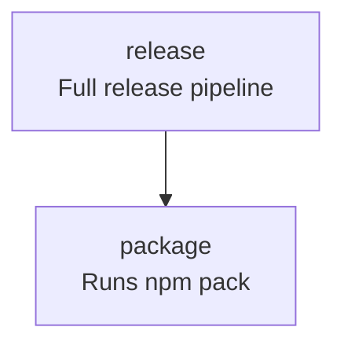

# nx-graph-to-mermaid

> Deterministically generates Mermaid task flow diagrams from NX `project.json` config files.

`nx-graph-to-mermaid` is an [Nx](https://nx.dev/) plugin that generates
deterministic [Mermaid](https://www.mermaid.ai/) task flow diagrams from an NX `project.json` file —
with optional Markdown injection and CI drift detection support.

It operates purely on the specified project.json and renders intra-project target 
dependencies only. It does not resolve cross-project or workspace-level graph relationships.


---

## Overview

The plugin operates in three primary modes:

### 1. `@datalackey/nx-graph-to-mermaid:generate`

Generates a deterministic Mermaid diagram from a specified `project.json`.

- Reads target definitions
- Reads `dependsOn` relationships
- Reads optional `description` metadata
- Outputs Mermaid markup to a file

This mode **only generates** the diagram.  
It does not modify any Markdown files.

---

### 2. `@datalackey/nx-graph-to-mermaid:inject`

Injects a previously generated Mermaid document into a Markdown file.

Required inputs:

- Path to generated Mermaid document
- Path to Markdown file (e.g. `README.md`)

The Mermaid block replaces the content between the fixed markers:

```
<!-- NX_GRAPH:START -->
<!-- NX_GRAPH:END -->
```

This mode performs **no graph generation**.  
It strictly handles deterministic injection.

---

### 3. `@datalackey/nx-graph-to-mermaid:check`

Validates that an existing Mermaid diagram matches what would currently be generated from `project.json`.

This mode:

- Regenerates the diagram in memory
- Compares it against the committed artifact
- Returns `{ success: false }` if drift is detected

This is intended for CI enforcement.

---

## Philosophy

Your `project.json` already defines the execution graph of your build.

By extending targets with a `description` field:

```json
"release": {
  "dependsOn": ["package"],
  "description": "Full release pipeline"
}
```

You embed documentation directly into the build definition.

`nx-graph-to-mermaid` compiles that metadata into a Mermaid diagram suitable for Markdown rendering on GitHub.

---

## Installation

```bash
npm install --save-dev @datalackey/nx-graph-to-mermaid
```

---

## Extending `project.json`

Add a `description` field to any target:

```json
{
  "targets": {
    "build": {
      "dependsOn": ["lint", "test"],
      "description": "Runs lint and test"
    }
  }
}
```

Nx ignores unknown fields, so this is safe.

---

# Usage

---

## Generate Mode

Add a target:

```json
"generate:task-graph": {
  "executor": "@datalackey/nx-graph-to-mermaid:generate",
  "options": {
    "projectJsonPath": "project.json",
    "outputPath": "docs/task-graph.md"
  }
}
```

Run:

```bash
npx nx run my-project:generate:task-graph
```

This writes a deterministic Mermaid diagram to the specified file.

---

## Inject Mode

Add a target:

```json
"inject:task-graph": {
  "executor": "@datalackey/nx-graph-to-mermaid:inject",
  "options": {
    "generatedPath": "docs/task-graph.md",
    "markdownPath": "README.md"
  }
}
```

Run:

```bash
npx nx run my-project:inject:task-graph
```

The content between:

```
<!-- NX_GRAPH:START -->
<!-- NX_GRAPH:END -->
```

is replaced with the generated Mermaid diagram.

No other content is modified.

---

## Check Mode (CI Drift Detection)

Add a target:

```json
"check:task-graph": {
  "executor": "@datalackey/nx-graph-to-mermaid:check",
  "options": {
    "projectJsonPath": "project.json",
    "existingPath": "docs/task-graph.md"
  }
}
```

Run:

```bash
npx nx run my-project:check:task-graph
```

If the generated output differs from the committed artifact:

- A failure message is printed
- The executor returns `{ success: false }`
- CI exits with a non-zero status

This prevents stale diagrams from being merged.

---

## Determinism

Output is fully deterministic:

- Targets are sorted alphabetically
- Dependencies are sorted
- Whitespace is normalized
- No timestamps
- No randomness

Identical input → identical output.

---

## Behavior Rules

- Only intra-project target dependencies are rendered
- Targets without descriptions render as single-line labels
- Unknown fields are ignored
- Cycles are rendered but not resolved
- No parsing of `nx graph`
- No HTML scraping
- No shell scripting

The tool operates purely on `project.json`.

---

## Example

Given:

```json
{
  "targets": {
    "release": {
      "dependsOn": ["package"],
      "description": "Full release pipeline"
    },
    "package": {
      "dependsOn": ["build"],
      "description": "Runs npm pack"
    }
  }
}
```

Generated output:



---

## Testing

All tests are written in JavaScript using Jest.

No shell scripts are used.

Test coverage includes:

- Deterministic output ordering
- Description handling
- Dependency edge generation
- Injection between markers
- Drift detection logic

Tests rely on fixture files and exact string comparisons.

---

## License

MIT
