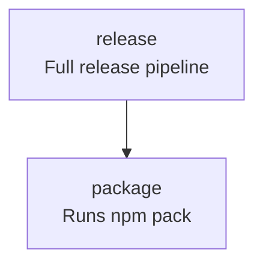

<!-- TOC:START -->
- [nx-graph-to-mermaid](#nx-graph-to-mermaid)
  - [Overview](#overview)
  - [Philosophy](#philosophy)
  - [Installation](#installation)
  - [Extending `project.json`](#extending-projectjson)
- [Usage](#usage)
  - [Generate Mode](#generate-mode)
  - [Inject Mode](#inject-mode)
  - [Update Mode (Generate + Inject)](#update-mode-generate--inject)
  - [Check Mode (CI Drift Detection)](#check-mode-ci-drift-detection)
  - [Determinism](#determinism)
  - [Behavior Rules](#behavior-rules)
  - [Example](#example)
  - [Future Directions](#future-directions)
    - [Decoupling the Graph Engine from Nx](#decoupling-the-graph-engine-from-nx)
    - [Why Consider Decoupling?](#why-consider-decoupling)
  - [Known Limitations](#known-limitations)
  - [License](#license)
<!-- TOC:END -->


# nx-graph-to-mermaid


> Deterministically generates Mermaid task flow diagrams from NX `project.json` config files.

`nx-graph-to-mermaid` is an [NX](https://nx.dev/) plugin that generates
deterministic [Mermaid](https://www.mermaid.ai/) task flow diagrams from an NX `project.json` file —
with optional Markdown injection and CI drift detection support.

It operates purely on the specified `project.json` and renders intra-project target dependencies only. It does not resolve cross-project or workspace-level graph relationships.
So, basically: no [monorepo](https://en.wikipedia.org/wiki/Monorepo) support... yet. (but contributions welcome!)


---

## Overview

The plugin supports four primary targets (modes):

- generate — Generates a deterministic Mermaid diagram from a specified `project.json`.
- inject — Injects a previously generated Mermaid document into a Markdown file between NX_GRAPH markers.
- check — Validates that an existing Mermaid diagram matches what would be generated from `project.json` (CI drift detection).
- update — Regenerates the Mermaid diagram and injects it into a Markdown file (generate + inject).

---

## Philosophy

Your `project.json` already defines the execution graph of your build.

By extending targets with a `description` field:

```json
{
  "release": {
    "dependsOn": ["package"],
    "description": "Full release pipeline"
  }
}
```

You embed documentation directly into the build definition.

`nx-graph-to-mermaid` compiles that metadata into a deterministic Mermaid diagram suitable for Markdown rendering on GitHub.

---

## Installation

```bash
npm install --save-dev @datalackey/nx-graph-to-mermaid
```

---

## Extending `project.json`

Add a `description` field to any target:

```json
{
    "targets": {
        "build": {
            "dependsOn": ["lint", "test"],
            "description": "Runs lint and test"
        }
    }
}
```

Nx ignores unknown fields, so this is safe.

---

# Usage

---

## Generate Mode

Add a target:

```json
{
  "generate:task-graph": {
    "executor": "@datalackey/nx-graph-to-mermaid:generate",
    "options": {
      "projectJsonPath": "project.json",
      "generatedMermaidPath": "docs/task-graph.md"
    }
  }
}
```

This mode:

- Reads target definitions from the specified `project.json`.
- Reads `dependsOn` relationships.
- Reads optional `description` metadata on targets.
- Outputs deterministic Mermaid markup to a file.

Run:

npx nx run my-project:generate:task-graph

This writes a deterministic Mermaid diagram to the specified file.

---

## Inject Mode

Add a target:

```json
{
  "inject:task-graph": {
    "executor": "@datalackey/nx-graph-to-mermaid:inject",
    "options": {
      "projectJsonPath": "project.json",
      "generatedMermaidPath": "docs/task-graph.md",
      "markdownPath": "README.md"
    }
  }
}
```

This mode:

- Injects a previously generated Mermaid document into a Markdown file.
- Requires a path to the generated Mermaid document and the target Markdown file.
- Replaces content between the fixed markers:


&nbsp;&nbsp;  &nbsp;&nbsp;  &nbsp; &lt;!-- NX_GRAPH:START --&gt;<br>
&nbsp;&nbsp;  &nbsp;&nbsp;  &nbsp; &lt;!-- NX_GRAPH:END --&gt;


This mode performs no graph generation and strictly handles deterministic injection.

Run:

```bash
npx nx run my-project:inject:task-graph
```

---

## Update Mode (Generate + Inject)

Add a target:

```json
{
  "update:task-graph": {
    "executor": "@datalackey/nx-graph-to-mermaid:update",
    "options": {
      "projectJsonPath": "project.json",
      "markdownPath": "README.md",
      "generatedMermaidPath": "docs/task-graph.md"
    }
  }
}
```

This mode:

- Reads `project.json` and generates fresh Mermaid output.
- Injects the generated Mermaid between NX_GRAPH markers in the target Markdown file.
- Optionally writes the generated artifact to disk when `generatedMermaidPath` is provided.

Run:

```bash
npx nx run my-project:update:task-graph
```

---

## Check Mode (CI Drift Detection)

Add a target:

```json
{
  "check:task-graph": {
    "executor": "@datalackey/nx-graph-to-mermaid:check",
    "options": {
      "projectJsonPath": "project.json",
      "generatedMermaidPath": "docs/task-graph.md"
    }
  }
}
```

This mode:

- Regenerates the diagram in memory and compares it against the committed artifact.
- Returns `{ success: false }` when drift is detected (intended for CI enforcement).

Run:

```
npx nx run my-project:check:task-graph
```

If the generated output differs from the committed artifact:

- A failure message is printed
- The executor returns `{ success: false }`
- CI exits with a non-zero status

This prevents stale diagrams from being merged.

---

## Determinism

Output is fully deterministic:

- Targets are sorted alphabetically
- Dependencies are sorted
- Whitespace is normalized
- No timestamps
- No randomness

Identical input → identical output.

---

## Behavior Rules

- Only intra-project target dependencies are rendered
- Missing dependencies cause failure
- Targets without descriptions render as single-line labels
- Unknown fields are ignored
- Cycles are rendered but not resolved
- No parsing of `nx graph`
- No HTML scraping

The tool operates purely on `project.json`.

---

## Example

Given:

```json
{
  "targets": {
    "release": {
      "dependsOn": ["package"],
      "description": "Full release pipeline"
    },
    "package": {
      "dependsOn": ["build"],
      "description": "Runs npm pack"
    }
  }
}
```

Generated output:



## Future Directions

### Decoupling the Graph Engine from Nx

`nx-graph-to-mermaid` is currently implemented as an Nx executor because it integrates cleanly into existing Nx workflows:

- Targets are already defined in `project.json`
- `dependsOn` relationships already form a directed task graph
- CI drift detection fits naturally into Nx task pipelines

However, the core rendering engine (`buildMermaid`) is intentionally Nx-agnostic.

It operates on a simple structure:

{
targets: {
[name: string]: {
dependsOn?: string[]
description?: string
}
}
}

This structure represents a generic directed task graph.
Nx is simply one producer of that graph.

### Why Consider Decoupling?

Over time, it may be valuable to separate:

- Graph extraction (Nx-specific)
- Graph rendering (generic Mermaid output)

This separation would allow:

- A standalone CLI mode:
  nx-graph-to-mermaid --input build-graph.json --output diagram.md
- Support for other build systems that can emit task graphs
- Use outside Nx workspaces
- Broader documentation tooling use cases
- Rendering CI pipelines or custom DAG definitions

The current implementation already contains a clean architectural boundary:

Nx Executor
↓
normalizeOptions
↓
buildMermaid()

A future CLI would simply call `buildMermaid()` directly.

---

## Known Limitations

- inject mode tests are currently skipped because they perturb npm publishing for @datalackey/nx-graph-to-mermaid


---

## License

MIT
