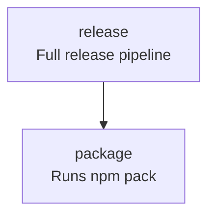

<!-- TOC:START -->
- [nx-graph-to-mermaid](#nx-graph-to-mermaid)
  - [Overview](#overview)
  - [Adding Documentation To NX Configuration](#adding-documentation-to-nx-configuration)
  - [Installation](#installation)
  - [Extending `project.json`](#extending-projectjson)
- [Usage](#usage)
  - [Generate Mode](#generate-mode)
  - [Inject Mode](#inject-mode)
  - [Update Mode (Generate + Inject)](#update-mode-generate--inject)
  - [Check Mode (CI Drift Detection)](#check-mode-ci-drift-detection)
  - [Determinism](#determinism)
  - [Behavior Rules](#behavior-rules)
  - [Example](#example)
  - [Future Directions](#future-directions)
    - [Decoupling the Graph Engine from NX](#decoupling-the-graph-engine-from-nx)
    - [Why Consider Decoupling?](#why-consider-decoupling)
  - [Known Limitations](#known-limitations)
  - [License](#license)
<!-- TOC:END -->


# nx-graph-to-mermaid

> Deterministically generates Mermaid task flow diagrams from NX `project.json` config files.

`nx-graph-to-mermaid` is an [NX](https://nx.dev/) plugin that generates
deterministic [Mermaid](https://www.mermaid.ai/) task flow diagrams from an NX `project.json` file —
with optional Markdown injection and CI drift detection support.

It operates purely on the specified `project.json` and renders intra-project target dependencies only. It does not resolve cross-project or workspace-level graph relationships.  
So, basically: no monorepo support (but contributions are always welcome!)

---

## Overview

The plugin integrates into NX via a custom executor, whose behavior is controlled entirely by `options.mode` (see below).

Supported modes:

- `generate` — Generate a deterministic Mermaid diagram from a specified `project.json`.
- `inject` — Inject a previously generated Mermaid document into a Markdown file between NX_GRAPH markers.
- `check` — Validate that an existing Mermaid diagram matches what would be generated from `project.json`.
- `update` — Regenerate the Mermaid diagram and inject it into a Markdown file.

---

## Adding Documentation To NX Configuration

Your `project.json` already defines the execution graph of your build.

By extending targets with a `description` field:

```json
{
  "release": {
    "dependsOn": ["package"],
    "description": "Full release pipeline"
  }
}
```

your documentation will co-reside with configuration metadata.

`nx-graph-to-mermaid` compiles that metadata into a deterministic Mermaid diagram suitable for Markdown rendering.

---

## Installation

```bash
npm install --save-dev @datalackey/nx-graph-to-mermaid
```

---

## Extending `project.json`

Add a `description` field to any target:

```json
{
  "targets": {
    "build": {
      "dependsOn": ["lint", "test"],
      "description": "Runs lint and test"
    }
  }
}
```

NX ignores unknown fields, so this is safe.

---

# Usage

All modes use the same executor:

```json
"executor": "@datalackey/nx-graph-to-mermaid"
```

Behavior is controlled exclusively by `options.mode`.

---

## Generate Mode

```json
{
  "task-graph:generate": {
    "executor": "@datalackey/nx-graph-to-mermaid",
    "options": {
      "mode": "generate",
      "projectJsonPath": "project.json",
      "generatedMermaidPath": "docs/task-graph.md"
    }
  }
}
```

Run:

```bash
npx nx run my-project:task-graph:generate
```

---

## Inject Mode

```json
{
  "task-graph:inject": {
    "executor": "@datalackey/nx-graph-to-mermaid",
    "options": {
      "mode": "inject",
      "projectJsonPath": "project.json",
      "generatedMermaidPath": "docs/task-graph.md",
      "markdownPath": "README.md"
    }
  }
}
```

Run:

```bash
npx nx run my-project:task-graph:inject
```

Markers required:

```
<!-- NX_GRAPH:START -->
<!-- NX_GRAPH:END -->
```

---

## Update Mode (Generate + Inject)

```json
{
  "task-graph:update": {
    "executor": "@datalackey/nx-graph-to-mermaid",
    "options": {
      "mode": "update",
      "projectJsonPath": "project.json",
      "markdownPath": "README.md",
      "generatedMermaidPath": "docs/task-graph.md"
    }
  }
}
```

Run:

```bash
npx nx run my-project:task-graph:update
```

---

## Check Mode (CI Drift Detection)

```json
{
  "task-graph:check": {
    "executor": "@datalackey/nx-graph-to-mermaid",
    "options": {
      "mode": "check",
      "projectJsonPath": "project.json",
      "generatedMermaidPath": "docs/task-graph.md"
    }
  }
}
```

Run:

```bash
npx nx run my-project:task-graph:check
```

Fails CI if drift is detected.

---

## Determinism

Output is fully deterministic:

- Targets sorted alphabetically
- Dependencies sorted
- Whitespace normalized
- No timestamps
- No randomness

Identical input → identical output.

---

## Behavior Rules

- Only intra-project target dependencies are rendered
- Missing dependencies cause failure
- Targets without descriptions render as single-line labels
- Unknown fields are ignored
- Cycles are rendered but not resolved

---

## Example

Given:

```json
{
  "targets": {
    "release": {
      "dependsOn": ["package"],
      "description": "Full release pipeline"
    },
    "package": {
      "dependsOn": ["build"],
      "description": "Runs npm pack"
    }
  }
}
```

Generated output:



---

## Future Directions

The rendering engine (`buildMermaid`) is NX-agnostic.

It operates on:

```
{
  targets: {
    [name: string]: {
      dependsOn?: string[]
      description?: string
    }
  }
}
```

NX is simply one producer of that structure.

---

## Known Limitations

- inject mode tests are currently skipped because they perturb npm publishing

---

## License

MIT