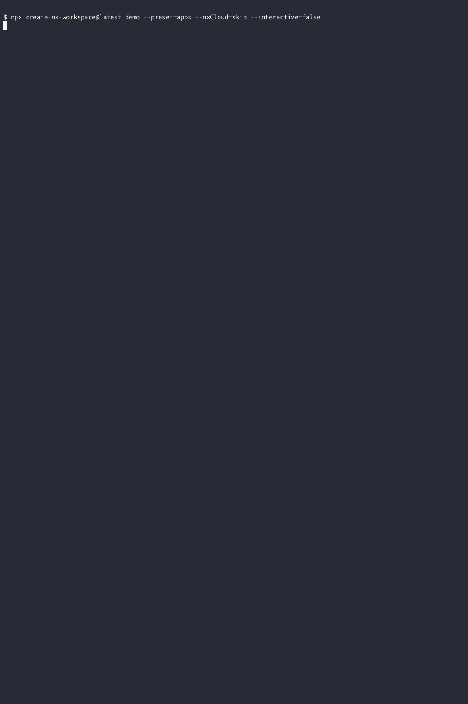
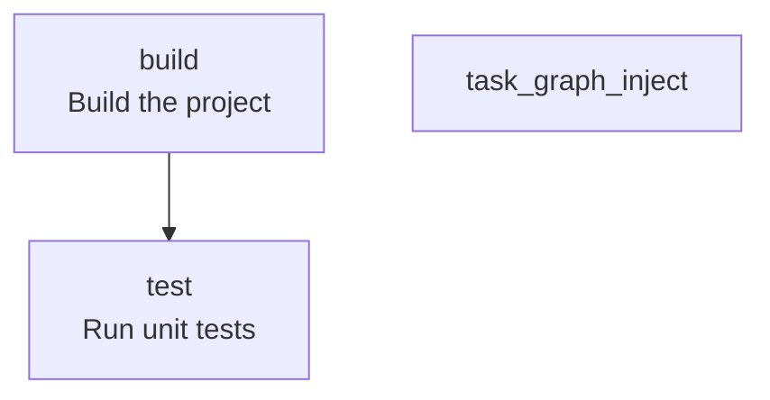

<!-- TOC:START -->
- [@doikayt/NX-graph-to-mermaid](#doikaytnx-graph-to-mermaid)
  - [Overview](#overview)
  - [Adding Documentation To NX Configuration](#adding-documentation-to-nx-configuration)
  - [Installation](#installation)
  - [Extending `project.json`](#extending-projectjson)
  - [Dependency Rendering](#dependency-rendering)
- [Usage](#usage)
  - [Diagram Injection Targets Special Start/End Markers](#diagram-injection-targets-special-startend-markers)
  - [Generate Mode](#generate-mode)
  - [Inject Mode](#inject-mode)
  - [Update Mode (Generate + Inject)](#update-mode-generate--inject)
  - [Check Mode (CI Drift Detection)](#check-mode-ci-drift-detection)
  - [Debug Mode](#debug-mode)
- [Single-File Operation Only](#single-file-operation-only)
- [Determinism](#determinism)
- [Full Example](#full-example)
- [Built With](#built-with)
- [Packaging, Publishing, and Inter-relationship with Other Plugins](#packaging-publishing-and-inter-relationship-with-other-plugins)
  - [Contributing and Releasing](#contributing-and-releasing)
- [License](#license)
<!-- TOC:END -->


# @doikayt/NX-graph-to-mermaid

> Deterministically generates Mermaid task flow diagrams from NX `project.json` config files.

`NX-graph-to-mermaid` is an **NX** (See: https://NX.dev/) plugin that generates deterministic [Mermaid](https://www.mermaid.ai/) task flow diagrams from an NX `project.json` file — with optional Markdown injection and CI drift detection support.

It operates purely on the specified `project.json`. Cross-project dependencies are named in the diagram but not expanded — their internal target graphs are not followed.

So, basically: no monorepo recursion (but contributions are always welcome!)


<p align="center">
  
</p>


In the above quick demo, we use the `nx-graph-to-mermaid` plugin to update this README file:

```aiignore
  # Sample Project

  ## Task Graph

  <!-- NX_GRAPH:START -->
  <!-- NX_GRAPH:END -->
  EOF

```

Between the START and END markers we inject a Mermaid diagram generated from a `project.json` file
with contents like this:

```aiignore
{
  "name": "sample",
  "targets": {
    "test": {
      "executor": "nx:run-commands",
      "description": "Run unit tests",
      "options": {
        "command": "echo Running tests"
      }
    },
    "build": {
      "executor": "nx:run-commands",
      "description": "Build the project",
      "dependsOn": ["test"],
      "options": {
        "command": "echo Building project"
      }
    },
    "task-graph:inject": {
      "executor": "@doikayt/nx-graph-to-mermaid:run",
      "options": {
        "mode": "update",
        "projectJsonPath": "apps/sample/project.json",
        "markdownPath": "apps/sample/README.md"
      }
    }
  }
}
```

This image will be generated as a result




See [Full Example](#full-example) for a more extensive
example of how project.json relates to the corresponding generated Mermaid diagram.

---


## Overview

Plugin behavior is controlled entirely by `options.mode`.

Supported modes:

- `generate` — Generate a deterministic Mermaid diagram from a specified `project.json`.
- `inject` — Inject a previously generated Mermaid document into a Markdown file between NX_GRAPH markers.
- `check` — Validate that an existing Mermaid diagram matches what would be generated from `project.json`.
- `update` — Regenerate the Mermaid diagram and inject it into a Markdown file.


## Adding Documentation To NX Configuration

Your [`project.json`](https://NX.dev/docs/reference/project-configuration) already defines the execution graph of your build.

By extending targets with a `description` field:

```json
{
  "release": {
    "dependsOn": ["package"],
    "description": "Full release pipeline"
  }
}
```
your documentation will co-reside with configuration metadata.

`nx-graph-to-mermaid` compiles that metadata into a deterministic Mermaid diagram suitable for Markdown rendering.

---

## Installation

```bash
npm install --save-dev @doikayt/nx-graph-to-mermaid
```

---

## Extending `project.json`

Add a `description` field to any target:

```json
{
  "targets": {
    "build": {
      "dependsOn": ["lint", "test"],
      "description": "Runs lint and test"
    }
  }
}
```

NX ignores unknown fields, so this is safe.

---

## Dependency Rendering

Each string in a `dependsOn` array is classified and rendered as follows:

| Entry form | Example | Rendered as |
|---|---|---|
| Plain local target name | `"lint"` | Arrow to that target node |
| Same-project qualified ref | `"my-project:check-all"` | Arrow to the local target (prefix stripped) |
| `^` upstream fan-out | `"^build"` | Arrow to a synthetic `^build` stadium node |
| Cross-project ref | `"@scope/pkg:build"` | Arrow to a synthetic `pkg:build` hexagon node (scope stripped from label) |

**`^` fan-out deps** deserve special mention. NX's `^target` shorthand means "before running this target, 
run `target` across every project in the upstream dependency closure." For example, `^build` on a `ci` task 
triggers a `build` run on all packages listed in `implicitDependencies` — and transitively 
on their dependencies — before `ci` is allowed to start. It is a graph-wide fan-out, 
not a reference to any single local target.

The diagram renders `^target` entries as synthetic pill-shaped (stadium) nodes — e.g. `([^build])` — so 
the dependency is visible without implying a local target exists. Multiple targets that share the same `^dep` 
all point to the same synthetic node.

**Cross-project refs** (e.g. `@scope/pkg:build`) are rendered as **hexagon** nodes. The org 
scope (`@scope/`) is stripped from the display label for readability — so 
`@doikayt/tooling-core:lint` appears as `tooling-core:lint` inside the hex. 
The full dep string is still encoded in the node ID in the Mermaid source. The 
ref is named but not expanded — the internal dependency graph of the referenced project is not followed.

For an example of how all this appears together in a diagram, refer to the 
[Build Targets](../README.md#build-targets) section  of the README
for  the orchestrating workspace.

---

# Usage

All modes use the same executor:

```json
"executor": "@doikayt/nx-graph-to-mermaid:run"
```

Behavior is controlled exclusively by `options.mode`.


## Diagram Injection Targets Special Start/End Markers

NX-graph-to-mermaid uses fixed markers to inject the generated Mermaid diagram into a Markdown file:

```
<!-- NX_GRAPH:START -->
<!-- NX_GRAPH:END -->
```


---

## Generate Mode

Add a target:

```json
{
  "task-graph:generate": {
    "executor": "@doikayt/nx-graph-to-mermaid:run",
    "options": {
      "mode": "generate",
      "projectJsonPath": "project.json",
      "generatedMermaidPath": "docs/task-graph.md"
    }
  }
}
```

**This mode:**  
Reads the specified `project.json`, extracts all target definitions, resolves `dependsOn` relationships, and 
incorporates optional `description` metadata. It then renders a fully deterministic Mermaid diagram and writes it to disk.

What it does:

- Reads target definitions
- Reads `dependsOn` relationships
- Reads optional `description` metadata
- Sorts targets deterministically
- Sorts dependencies deterministically
- Outputs normalized Mermaid markup

Run:

```bash
npx nx run my-project:task-graph:generate
```

---

## Inject Mode

Add a target:

```json
{
  "task-graph:inject": {
    "executor": "@doikayt/nx-graph-to-mermaid:run",
    "options": {
      "mode": "inject",
      "projectJsonPath": "project.json",
      "generatedMermaidPath": "docs/task-graph.md",
      "markdownPath": "README.md"
    }
  }
}
```

**This mode:**  
Performs deterministic Markdown injection only. It does not generate a graph. It reads a previously generated Mermaid artifact and replaces the content between fixed markers inside the specified Markdown file.

It requires:

- A path to the generated Mermaid document
- A path to the target Markdown file


Run:

```bash
npx nx run my-project:task-graph:inject
```

---

## Update Mode (Generate + Inject)

Add a target:

```json
{
  "task-graph:update": {
    "executor": "@doikayt/nx-graph-to-mermaid:run",
    "options": {
      "mode": "update",
      "projectJsonPath": "project.json",
      "markdownPath": "README.md",
      "generatedMermaidPath": "docs/task-graph.md"
    }
  }
}
```

**This mode:**  
Combines generation and injection in a single deterministic operation. It regenerates the Mermaid diagram from `project.json`, injects it into the specified Markdown file between NX_GRAPH markers, and optionally writes the generated artifact to disk.

> **`generatedMermaidPath` is optional in update mode.** Omit it to regenerate and inject in one step without writing a separate Mermaid file to disk.

Run:

```bash
npx nx run my-project:task-graph:update
```

---

## Check Mode (CI Drift Detection)

Add a target:

```json
{
  "task-graph:check": {
    "executor": "@doikayt/nx-graph-to-mermaid:run",
    "options": {
      "mode": "check",
      "projectJsonPath": "project.json",
      "markdownPath": "README.md"
    }
  }
}
```

**This mode:**  
Regenerates the diagram in memory and compares it against the content currently between the `NX_GRAPH` markers in the specified Markdown file. If any difference is detected, it returns `{ success: false }`, making it suitable for CI enforcement.

Run:

```bash
npx nx run my-project:task-graph:check
```

If drift is detected:

- A failure message is printed
- The executor returns `{ success: false }`
- CI exits with a non-zero status

This prevents stale diagrams from being merged.

> **Setup requirement:** check mode compares the current marker content byte-for-byte against the freshly generated diagram. A file with empty markers (no injected content yet) will always fail. Run `update` mode once first to populate the markers, then commit the result before enabling check mode in CI.

---

## Debug Mode

Add `"debug": true` to any executor target's options to emit diagnostic messages
to `stderr`. Each message is prefixed with `[debug]`, keeping it separate from
normal stdout output and safe to ignore in CI logs.

```json
{
  "task-graph:update": {
    "executor": "@doikayt/nx-graph-to-mermaid:run",
    "options": {
      "mode": "update",
      "projectJsonPath": "project.json",
      "markdownPath": "README.md",
      "debug": true
    }
  }
}
```

Each run logs:

- Raw and normalized options (mode, resolved file paths)
- Number of targets loaded from `project.json`
- Length of the generated Mermaid output
- Final `{ success }` result

---

# Single-File Operation Only

This tool operates on an explicit (`projectJsonPath`, `markdownPath`) pair and does not 
support recursive folder traversal. Each `NX_GRAPH` marker block is tied to a 
specific `project.json`, so the association must be declared explicitly 
via the aforementioned executor options pair. 

---

# Determinism

Output is fully deterministic:

- Targets sorted alphabetically
- Dependencies sorted
- Whitespace normalized
- No timestamps
- No randomness

The tool operates purely on `project.json`.
Identical input → identical output.


---

# Full Example

A six-stage pipeline: `lint` and `docs` are independent roots; `test` depends on `lint`; `build` depends on both `lint` and `test`; `package` depends on `build`; `release` converges both `package` and `docs`.

- Input: [`tests/fixtures/realistic-pipeline/project.json`](tests/fixtures/realistic-pipeline/project.json)
- Golden output: [`tests/fixtures/realistic-pipeline/expected-readme.md`](tests/fixtures/realistic-pipeline/expected-readme.md)

The golden file is the CI assertion — `check` mode regenerates the diagram and diffs against it, so the output can never silently drift.

---
# Built With

- [`@doikayt/tooling-core`](../tooling-core/README.md) — shared internal utilities

For the full workspace tech stack see: [TECH-STACK.md](../TECH-STACK.md)

---
# Packaging, Publishing, and Inter-relationship with Other Plugins

This package is one component of a small ecosystem of JavaScript tooling plugins maintained as individual npm packages in this repository.  The versioning and release of these packages is governed by a coordinated release policy, and the packages adhere to common design and architectural principles policies that are more completely described [here](../README.md).


---


## Contributing and Releasing

For code overview, development setup, build workflow, and release procedures (including how to
trigger a publish via Changesets), see
[CONTRIBUTING.md](./docs/CONTRIBUTING.md).

---


# License

MIT
