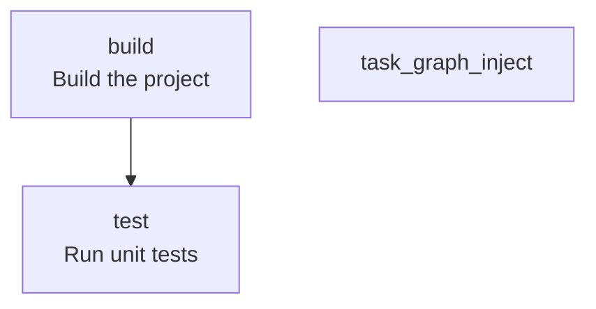
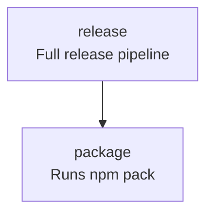

<!-- TOC:START -->
- [NX-graph-to-mermaid](#nx-graph-to-mermaid)
  - [Overview](#overview)
  - [Adding Documentation To NX Configuration](#adding-documentation-to-nx-configuration)
  - [Installation](#installation)
  - [Extending `project.json`](#extending-projectjson)
- [Usage](#usage)
  - [Diagram Injection Targets Special Start/End Markers](#diagram-injection-targets-special-startend-markers)
  - [Generate Mode](#generate-mode)
  - [Inject Mode](#inject-mode)
  - [Update Mode (Generate + Inject)](#update-mode-generate--inject)
  - [Check Mode (CI Drift Detection)](#check-mode-ci-drift-detection)
- [Determinism](#determinism)
- [Example](#example)
- [License](#license)
<!-- TOC:END -->


# NX-graph-to-mermaid

> Deterministically generates Mermaid task flow diagrams from NX `project.json` config files.

`NX-graph-to-mermaid` is an [NX](https://NX.dev/) plugin that generates deterministic [Mermaid](https://www.mermaid.ai/) task flow diagrams from an NX `project.json` file — with optional Markdown injection and CI drift detection support.

It operates purely on the specified `project.json` and renders intra-project target dependencies only. It does not resolve cross-project or workspace-level graph relationships.

So, basically: no monorepo support (but contributions are always welcome!)


<p align="center">
  
</p>


In the above quick demo, we use the `nx-graph-to-mermaid` plugin to update this README file:

```aiignore
  # Sample Project

  ## Task Graph

  <!-- NX_GRAPH:START -->
  <!-- NX_GRAPH:END -->
  EOF

```

This image will be generated from the `project.json` file in the root of this repository:




See [Example](#example) for how project.json relates to the corresponding generated Mermaid diagram.


---

## Overview

Plugin behavior is controlled entirely by `options.mode`.

Supported modes:

- `generate` — Generate a deterministic Mermaid diagram from a specified `project.json`.
- `inject` — Inject a previously generated Mermaid document into a Markdown file between NX_GRAPH markers.
- `check` — Validate that an existing Mermaid diagram matches what would be generated from `project.json`.
- `update` — Regenerate the Mermaid diagram and inject it into a Markdown file.


## Adding Documentation To NX Configuration

Your [`project.json`](https://NX.dev/docs/reference/project-configuration) already defines the execution graph of your build.

By extending targets with a `description` field:

```json
{
  "release": {
    "dependsOn": ["package"],
    "description": "Full release pipeline"
  }
}
```
your documentation will co-reside with configuration metadata.

`nx-graph-to-mermaid` compiles that metadata into a deterministic Mermaid diagram suitable for Markdown rendering.

---

## Installation

```bash
npm install --save-dev @datalackey/nx-graph-to-mermaid
```

---

## Extending `project.json`

Add a `description` field to any target:

```json
{
  "targets": {
    "build": {
      "dependsOn": ["lint", "test"],
      "description": "Runs lint and test"
    }
  }
}
```

NX ignores unknown fields, so this is safe.

---

# Usage

All modes use the same executor:

```json
"executor": "@datalackey/nx-graph-to-mermaid"
```

Behavior is controlled exclusively by `options.mode`.


## Diagram Injection Targets Special Start/End Markers

NX-graph-to-mermaid uses fixed markers to inject the generated Mermaid diagram into a Markdown file:

```
<!-- NX_GRAPH:START -->
<!-- NX_GRAPH:END -->
```


---

## Generate Mode

Add a target:

```json
{
  "task-graph:generate": {
    "executor": "@datalackey/nx-graph-to-mermaid",
    "options": {
      "mode": "generate",
      "projectJsonPath": "project.json",
      "generatedMermaidPath": "docs/task-graph.md"
    }
  }
}
```

**This mode:**  
Reads the specified `project.json`, extracts all target definitions, resolves `dependsOn` relationships, and 
incorporates optional `description` metadata. It then renders a fully deterministic Mermaid diagram and writes it to disk.

What it does:

- Reads target definitions
- Reads `dependsOn` relationships
- Reads optional `description` metadata
- Sorts targets deterministically
- Sorts dependencies deterministically
- Outputs normalized Mermaid markup

Run:

```bash
npx NX run my-project:task-graph:generate
```

---

## Inject Mode

Add a target:

```json
{
  "task-graph:inject": {
    "executor": "@datalackey/nx-graph-to-mermaid",
    "options": {
      "mode": "inject",
      "projectJsonPath": "project.json",
      "generatedMermaidPath": "docs/task-graph.md",
      "markdownPath": "README.md"
    }
  }
}
```

**This mode:**  
Performs deterministic Markdown injection only. It does not generate a graph. It reads a previously generated Mermaid artifact and replaces the content between fixed markers inside the specified Markdown file.

It requires:

- A path to the generated Mermaid document
- A path to the target Markdown file


Run:

```bash
npx NX run my-project:task-graph:inject
```

---

## Update Mode (Generate + Inject)

Add a target:

```json
{
  "task-graph:update": {
    "executor": "@datalackey/nx-graph-to-mermaid",
    "options": {
      "mode": "update",
      "projectJsonPath": "project.json",
      "markdownPath": "README.md",
      "generatedMermaidPath": "docs/task-graph.md"
    }
  }
}
```

**This mode:**  
Combines generation and injection in a single deterministic operation. It regenerates the Mermaid diagram from `project.json`, injects it into the specified Markdown file between NX_GRAPH markers, and optionally writes the generated artifact to disk.

Run:

```bash
npx NX run my-project:task-graph:update
```

---

## Check Mode (CI Drift Detection)

Add a target:

```json
{
  "task-graph:check": {
    "executor": "@datalackey/nx-graph-to-mermaid",
    "options": {
      "mode": "check",
      "projectJsonPath": "project.json",
      "generatedMermaidPath": "docs/task-graph.md"
    }
  }
}
```

**This mode:**  
Regenerates the diagram in memory and compares it against the committed Mermaid artifact. If any difference is detected, it returns `{ success: false }`, making it suitable for CI enforcement.

Run:

```bash
npx NX run my-project:task-graph:check
```

If drift is detected:

- A failure message is printed
- The executor returns `{ success: false }`
- CI exits with a non-zero status

This prevents stale diagrams from being merged.

---

# Determinism

Output is fully deterministic:

- Targets sorted alphabetically
- Dependencies sorted
- Whitespace normalized
- No timestamps
- No randomness

The tool operates purely on `project.json`.
Identical input → identical output.


---

# Example

Given:

```json
{
  "targets": {
    "release": {
      "dependsOn": ["package"],
      "description": "Full release pipeline"
    },
    "package": {
      "dependsOn": ["build"],
      "description": "Runs npm pack"
    }
  }
}
```

Generated output:




# License

MIT