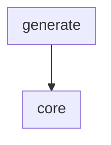
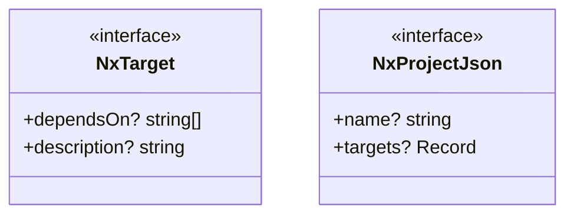
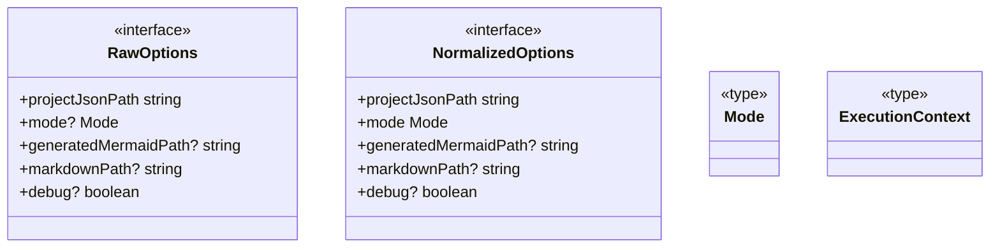

# Contributing to @doikayt/nx-graph-to-mermaid

# Code Structure Diagrams

## Component Diagram

<!-- UML:components:START -->

<!-- UML:components:END -->

## Components Table

<!-- UML:components-table:START -->
| Component | Description |
|-----------|-------------|
| [core](#core) | Mermaid diagram builder: validates an NX `project.json` targets map and emits a deterministic `graph TD` diagram with sanitized node IDs and sorted dependency edges |
| [generate](#generate) | NX executor entry point: resolves options, dispatches to `generate`, `inject`, `update`, or `check` mode, and writes the Mermaid diagram into a target Markdown file between `<!-- NX_GRAPH:START -->` / `<!-- NX_GRAPH:END -->` markers |
<!-- UML:components-table:END -->

## Component Details

<!-- UML:component-details:START -->
#### core

#### generate

<!-- UML:component-details:END -->

# Build and Release 

For workspace-level setup, build pipeline, and release workflow see:
[javascript/docs/CONTRIBUTING.md](../../docs/CONTRIBUTING.md)

---

*Package-specific contributor documentation coming soon.*
