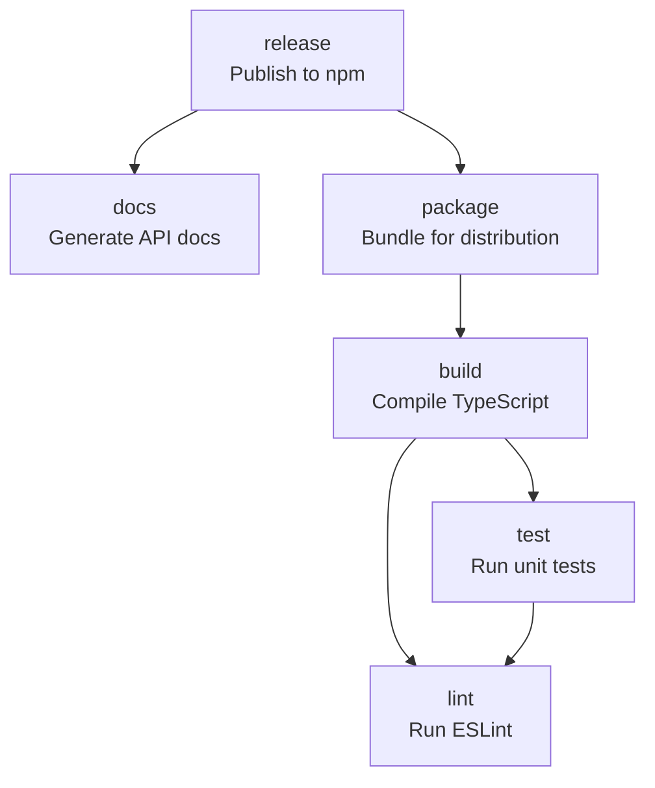

# My Project

## Task Graph

<!-- NX_GRAPH:START -->

```mermaid
graph TD

  build["build<br/>Compile TypeScript"]
  docs["docs<br/>Generate API docs"]
  lint["lint<br/>Run ESLint"]
  package["package<br/>Bundle for distribution"]
  release["release<br/>Publish to npm"]
  test["test<br/>Run unit tests"]

  build --> lint
  build --> test
  package --> build
  release --> docs
  release --> package
  test --> lint
```
<!-- NX_GRAPH:END -->
