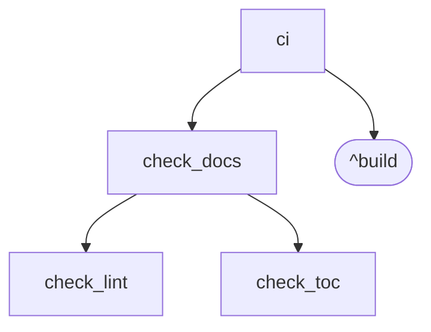

# My Workspace

## Task Graph

<!-- NX_GRAPH:START -->

```mermaid
graph TD

  check_docs
  check_lint
  check_toc
  ci

  _caret_build(["^build"])

  check_docs --> check_lint
  check_docs --> check_toc
  ci --> _caret_build
  ci --> check_docs
```
<!-- NX_GRAPH:END -->
