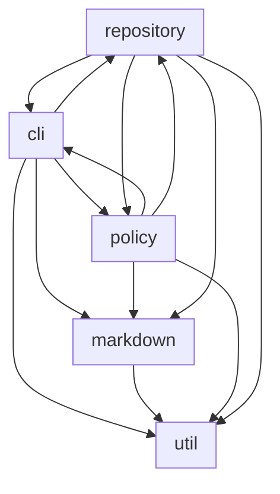
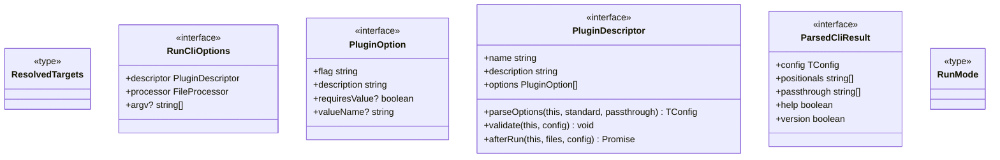
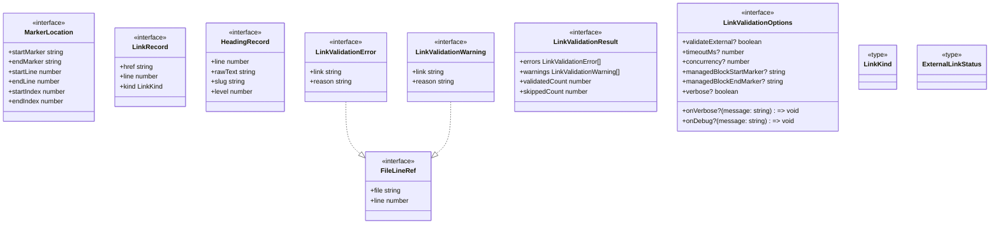
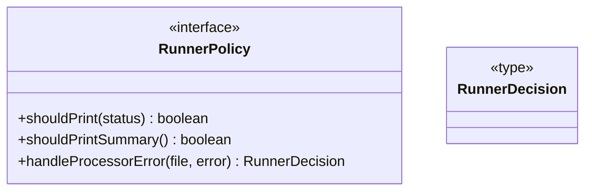
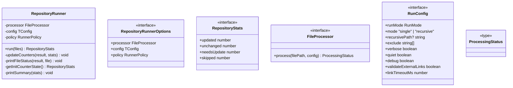
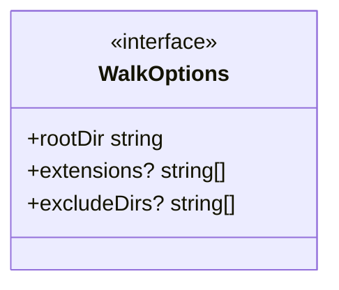

# @datalackey/tooling-core

Shared logic and CLI framework for the JavaScript tooling ecosystem in this repository.

This package is the foundation on which all CLI plugins in this workspace are built —
[`update-markdown-toc`](../update-markdown-toc/README.md),
[`nx-graph-to-mermaid`](../nx-graph-to-mermaid/README.md), and
[`update-markdown-uml`](../update-markdown-uml/README.md) all depend on it.
It can also be used independently to build your own Node.js CLI tools that follow the same
conventions.

---

## Overview

`tooling-core` provides:

- **CLI framework** — argument parsing, help generation, plugin descriptor wiring, and
  exit code management via `runCli` and `PluginDescriptor`
- **File processing** — recursive directory traversal, single-file and recursive modes,
  deterministic ordering via `walkFiles` and `listFilesToProcess`
- **Markdown utilities** — marker-based content injection (`injectBetweenMarkers`),
  heading extraction, link extraction, fragment and relative link validation
- **Repository runner** — orchestrates file processing with policy-driven error handling
  and output formatting via `RepositoryRunner`
- **Shared types** — see below

---

## Shared Types

- [`RunConfig`](src/repository/types.ts) — base configuration passed to every file processor;
  carries mode, verbosity, debug, exclude list, and run mode (`update` vs `check`)
- [`ProcessingStatus`](src/repository/types.ts) — return value from a `FileProcessor`;
  one of `"updated"`, `"unchanged"`, `"needs update"`, or `"skipped"`
- [`FileProcessor`](src/repository/types.ts) — interface a plugin implements;
  single `process(filePath, config)` method
- [`PluginDescriptor`](src/cli/types.ts) — declarative plugin metadata;
  name, description, options, optional `parseOptions`, `validate`, and `afterRun` hooks
- [`PluginOption`](src/cli/types.ts) — describes a single custom CLI flag declared by a plugin
- [`ParsedCliResult`](src/cli/types.ts) — result returned by `parseStandardCli`;
  carries parsed config, positionals, passthrough  flags (those custom to your tool), and help/version booleans
- [`RunMode`](src/cli/types.ts) — `"update"` or `"check"`
- [`RunnerPolicy`](src/policy/RunnerPolicy.ts) —  interface controlling per-file processing decisions and
  error handling strategy in `RepositoryRunner`
- [`RunnerDecision`](src/policy/RunnerPolicy.ts) — `"abort"` or `"continue"`;
  returned by `RunnerPolicy.handleProcessorError`
- [`RepositoryStats`](src/repository/RepositoryRunner.ts) — counts of updated, unchanged,
  needs update, and skipped files returned by `RepositoryRunner.run`

---

## Installation
```bash
npm install @datalackey/tooling-core
```

> Node.js ≥ 18 required. ESM only.

---

## Usage

The primary entry point for plugin authors is `runCli`. A minimal plugin looks like this:
```typescript
import { runCli } from "@datalackey/tooling-core";
import type {
  PluginDescriptor,
  FileProcessor,
  RunConfig,
  ProcessingStatus,
} from "@datalackey/tooling-core";

// 1. Extend RunConfig to carry your plugin-specific options.
interface MyPluginConfig extends RunConfig {
  skipJs: boolean;          // skip processing of Javascript files
}

// 2. Declare your plugin's metadata and custom CLI flags.
const descriptor: PluginDescriptor<MyPluginConfig> = {
  name: "my-plugin",
  description: "do something with all non-Javascript files ",
  options: [
    {
      flag: "--skip-js",
      description: "Skip processing and log Skipped: <file> instead",
    },
    {
      flag: "-s",
      description: "Short form of --skip-js",
    },
  ],
  parseOptions(standard, passthrough): MyPluginConfig {
    const skipJs =
      passthrough.get("--skip-js") === true ||
      passthrough.get("-s") === true;
    return {
      ...standard,
      skipJs: skipJs,
    };
  },
};

// 3. Implement your file processor.
const processor: FileProcessor<MyPluginConfig> = {
  process(filePath: string, config: MyPluginConfig): ProcessingStatus {
    if (config.skipJs && filePath.endsWith(".js")) {
      return "skipped";
    }
    // ... transform filePath content here ...
    return "updated";
  },
};

// 4. Wire everything together.
await runCli({ descriptor: descriptor, processor: processor });
```

This gives your plugin standard `--check`, `--recursive`, `--verbose`, `--quiet`,
`--debug`, and `--help` flags with no additional configuration, plus your own
`--skip-js` / `-s` flag wired through automatically.

For a complete real-world example see
[`update-markdown-toc`](../update-markdown-toc/README.md).

---
## Package Structure

<!-- UML:components:START -->

<!-- UML:components:END -->

<!-- UML:components-table:START -->
| Component | Description |
|-----------|-------------|
| [cli](#cli) | CLI framework for tooling-core plugins: parses arguments via `parseStandardCli`, validates and wires plugin-declared flags, generates help output, resolves target file lists, and drives the full CLI lifecycle through `runCli` |
| [markdown](#markdown) | Markdown utilities: marker-based content injection (`injectBetweenMarkers`), heading extraction, link extraction, fragment/relative/external link validation, and GitHub-compatible slug generation |
| [policy](#policy) | Execution policy interface (`RunnerPolicy`) that controls per-file output decisions and error-handling strategy (abort vs |
| [repository](#repository) | Repository orchestration layer: `RepositoryRunner` drives a `FileProcessor` over a list of files, accumulates `RepositoryStats`, and delegates per-file output and error decisions to a `RunnerPolicy` |
| [util](#util) | Low-level utilities: deterministic lexicographic filesystem walker (`walkFiles`), `debugLog` helper, and concurrency primitives |
<!-- UML:components-table:END -->

<!-- UML:component-details:START -->
#### cli


#### markdown


#### policy


#### repository


#### util

<!-- UML:component-details:END -->


## Tech Stack

For the full workspace tech stack see: [TECH-STACK.md](../TECH-STACK.md)

---

## Contributing

For code overview, development setup, build workflow, and release procedures (including how to
trigger a publish via Changesets), see
[CONTRIBUTING.md](./docs/CONTRIBUTING.md).


---

## Packaging, Publishing, and Inter-relationship with Other Plugins

This package is one component of a small ecosystem of JavaScript tooling plugins
maintained as individual npm packages in this repository. The versioning and release
of these packages is governed by a coordinated release policy, and the packages adhere
to common design and architectural principles described [here](../README.md).