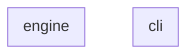
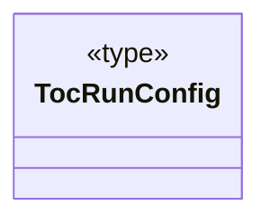
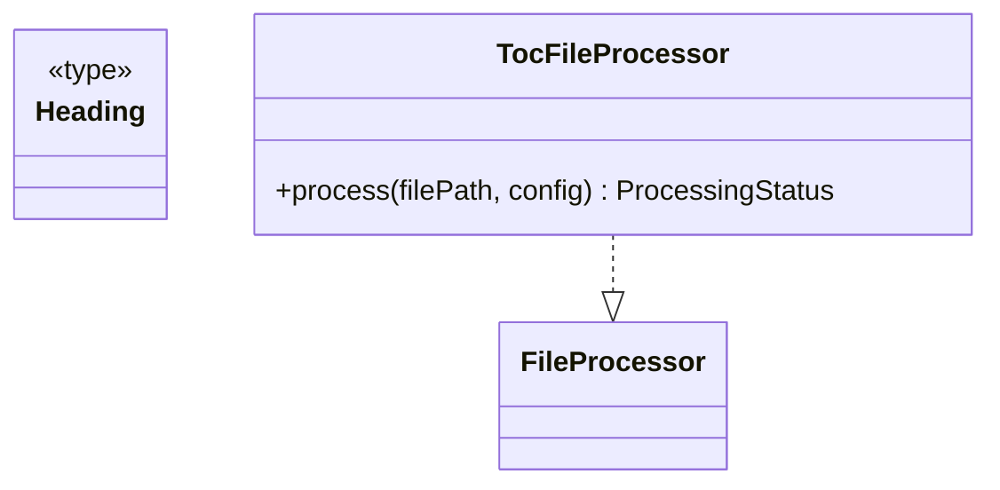

# Guidelines for Project Contributors


<!-- TOC:START -->
- [Guidelines for Project Contributors](#guidelines-for-project-contributors)
  - [Code Structure Diagrams](#code-structure-diagrams)
    - [Component Diagram](#component-diagram)
    - [Components Table](#components-table)
    - [Component Details](#component-details)
  - [Running Tests](#running-tests)
    - [Run the full test suite](#run-the-full-test-suite)
    - [Run a single test suite](#run-a-single-test-suite)
    - [Test trace mode (recommended when debugging)](#test-trace-mode-recommended-when-debugging)
<!-- TOC:END -->


This document describes workflows intended for maintainers of update-markdown-toc. End users do not need these steps.

For workspace-level setup, build pipeline, and release workflow see: [javascript/docs/CONTRIBUTING.md](../../docs/CONTRIBUTING.md)


## Code Structure Diagrams


### Component Diagram

<!-- UML:components:START -->

<!-- UML:components:END -->

### Components Table

<!-- UML:components-table:START -->
| Package | Description |
|---------|-------------|
| [cli](#cli) | Plugin wiring for `update-markdown-toc`: declares the `PluginDescriptor` (no custom flags) and the `afterRun` hook that triggers link validation when running in `--check` mode |
| [engine](#engine) | TOC generation engine: parses Markdown headings (skipping fenced code blocks), generates GitHub-slugged anchor links, and injects the result between `<!-- TOC:START -->` / `<!-- TOC:END -->` markers |
<!-- UML:components-table:END -->

### Component Details

<!-- UML:component-details:START -->
#### cli


#### engine

<!-- UML:component-details:END -->


## Running Tests

All tests are shell-based and live under `scripts/`.

### Run the full test suite

From `javascript/update-markdown-toc/`:

```bash
bash scripts/run-all-tests.sh
```

This runs, in order:

- fixture-based TOC generation tests
- CLI contract tests
- recursive traversal tests

The test runner exits non-zero on the first failure.

### Run a single test suite

You can invoke any test script directly, for example:

```bash
bash scripts/recursive-traversal-test.sh
```

### Test trace mode (recommended when debugging)

All recursive-mode test scripts accept a test-harness trace flag (`--trace`), which prints the exact CLI command 
being executed before it runs. We may apply this to non-recursive tests in the future.

This flag does not alter CLI behavior. To enable CLI verbosity or debugging, re-run the printed command manually with `--verbose` or `--debug`.

Example output printed by the test harness:

```
[run] node bin/update-readme-toc.js --verbose --recursive /tmp/tmp.XYZ/tree
```

This trace output exists purely to aid test debugging and is independent of the CLI’s own `--verbose` flag.


