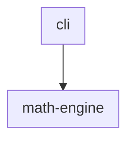
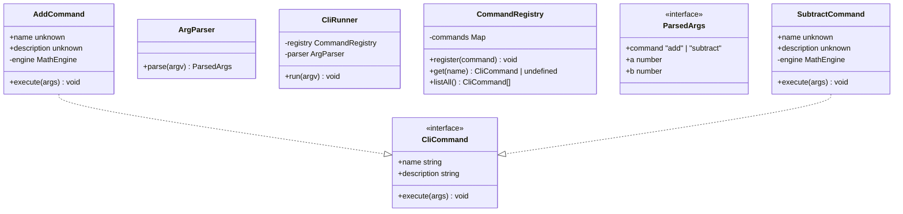
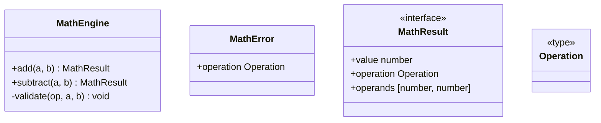

<!-- TOC:START -->
- [@datalackey/update-markdown-uml](#datalackeyupdate-markdown-uml)
  - [Terminology](#terminology)
  - [What It Does](#what-it-does)
    - [Function-only components](#function-only-components)
  - [Installation](#installation)
  - [Usage](#usage)
  - [Options](#options)
  - [Example](#example)
    - [Source tree](#source-tree)
    - [Generated output](#generated-output)
      - [cli](#cli)
      - [math-engine](#math-engine)
    - [Side Note on How to Correct Unknown Properties](#side-note-on-how-to-correct-unknown-properties)
  - [Built With](#built-with)
  - [Contributing and Releasing](#contributing-and-releasing)
<!-- TOC:END -->

# @datalackey/update-markdown-uml

Generates and validates UML class and component diagrams for TypeScript source
trees, injecting them into Markdown documentation files.

---

## Terminology

This tool uses **component** to denote a cohesive group of TypeScript source files
that live in a single directory under `src/`. This is the same concept Java
developers know as a *package* — a named namespace boundary that groups related
types and controls visibility. The word "package" is avoided here because in a
Node/npm workspace it already means something else (a publishable npm artifact),
which would create ambiguity.

## What It Does

Given a TypeScript project organised into components (one directory per
component under `src/`), this tool:

- generates a **component overview flowchart** showing cross-component
  import dependencies
- generates a **components table** with one row per component
- generates **per-component class diagrams** showing classes, interfaces,
  and type aliases

All three sections are injected into a single Markdown file between
fixed marker pairs. Running the tool again is a no-op if nothing has
changed — output is fully deterministic.

### Function-only components

When a component directory contains no classes, interfaces, or type aliases,
the class diagram falls back to a four-column Markdown table of exported
functions:

| Function | Parameters | Returns | Description |
|----------|------------|---------|-------------|
| `matchFields` | `template: Template`<br>`fields: FormField[]` | `MatchResult` | Partitions discovered fields into three buckets. |
| `isReactForm` | — | `boolean` | Returns `true` if any React signal is present. |

Details of the fallback format:

- **Parameters cell** — each parameter is formatted as `name: Type`; multiple
  parameters are stacked within the same cell using `<br>`. Zero-argument
  functions show `—`.
- **Description cell** — the first sentence of the function's JSDoc block
  (text up to and including the first `.`, or up to the first newline,
  whichever comes first). When no JSDoc description is present, `—` appears in
  the cell and a warning is emitted to stderr:
  ```
  warn: [ComponentName] function `functionName` has no JSDoc description
  ```
- **Empty component** — if a component has no exported functions, classes,
  interfaces, or types at all, the output is the single line
  `_No exported types or functions._` and a warning is emitted:
  ```
  warn: [ComponentName] has no exported functions, classes, interfaces, or types
  ```

Both warnings are suppressed when the CLI is run with `--quiet`.

---

## Installation

```bash
npm install --save-dev @datalackey/update-markdown-uml
```

---

## Usage

Place three marker pairs in the Markdown file where you want the diagrams
to appear:

&nbsp;&nbsp;&lt;!-- UML:components:START --&gt;<br>
&nbsp;&nbsp;&lt;!-- UML:components:END --&gt;

&nbsp;&nbsp;&lt;!-- UML:components-table:START --&gt;<br>
&nbsp;&nbsp;&lt;!-- UML:components-table:END --&gt;

&nbsp;&nbsp;&lt;!-- UML:component-details:START --&gt;<br>
&nbsp;&nbsp;&lt;!-- UML:component-details:END --&gt;

Then run:

```bash
npx update-markdown-uml README.md
```

The tool discovers `src/` automatically when it exists next to the target
Markdown file. Use `--source <path>` to override.

For CI drift detection, use `--check`:

```bash
npx update-markdown-uml --check README.md
```

---

## Options

```
update-markdown-uml [options] <file>

Options:
  --source <path>                       Override source root discovery (default: src/)
  --exclude-components <cmp1,cmp2>      Leaf directory names to exclude from all output
  --test-patterns-to-skip <pat1,pat2>   Glob patterns for test files to skip during discovery
  -t <pat1,pat2>                        Short form of --test-patterns-to-skip
  --check                               Do not write; exit non-zero if content is stale
  --verbose                             Print per-component type counts
  --quiet                               Suppress all non-error output
  --debug                               Print debug diagnostics to stderr
  --help                                Show this help message and exit
  --version                             Print version and exit
```

This tool processes a single Markdown file per invocation. Recursive folder
traversal is not supported — each UML diagram is tied to a specific source
tree, so the association must be declared explicitly. For workspace-wide runs
use [`autogen-markdown-doc`](../autogen-markdown-doc/README.md).

For full documentation of shared CLI behavior (`--check`, `--verbose`,
`--quiet`, exit codes) see
[Common CLI Behavior](../CLI-BEHAVIOR.md).

---

## Example

[This folder](./tests/e2e/fixtures/math-cli) contains a sample project that demonstrates 
the tool's output. 

Running the sample and reproducing the output you see above by 
actually installing and running the tool is a good way to get a feel for how it works.
Copy/paste the code below to clone the sample, install dependencies, and run the tool. 

To view the rendered mermaid graph you could use VSCode's built-in markdown preview, or push 
it to github and view it in the browser.


```bash

rm -rf /tmp/run-sample 
mkdir /tmp/run-sample 
cp -r javascript/update-markdown-uml/tests/e2e/fixtures/math-cli/* /tmp/run-sample/  
cd /tmp/run-sample/  
npm install
npx update-markdown-uml README.md
echo Load the README file into your favorite Markdown viewer. Enjoy the injected UML diagrams.

```


### Source tree

A simple two-component project: a `cli` layer that delegates computation to
a `math-engine` layer.

```
src/
  cli/
    AddCommand.ts
    ArgParser.ts
    CliCommand.ts
    CliRunner.ts
    CommandRegistry.ts
    ParsedArgs.ts
    SubtractCommand.ts
  math-engine/
    MathEngine.ts
    MathError.ts
    MathResult.ts
    Operation.ts
```

`cli` imports from `math-engine`. `math-engine` has no dependency on `cli`.

### Generated output

**Component overview** — one subgraph per component, arrows show import direction:



**Components table** — names link to the class diagram section below.
Descriptions are read from an optional `_COMPONENT_INFO.md` file in each
component directory; `TBD` appears when the file is absent. The description
is the first sentence of the file — text up to and including the first
period (`.`); everything after that period is ignored.

**Note:** if the file exists but contains no period, the description is
treated as missing (`TBD`) and a warning is printed identifying the file.
To suppress `TBD` without providing a description, create
`_COMPONENT_INFO.md` with a blank first line (no period needed for an
empty file).

| Component | Description |
|-----------|-------------|
| [cli](#cli) | Command-line interface layer that parses arguments and dispatches math operations to the math-engine component |
| [math-engine](#math-engine) | Code for System Backend -- which enables CLI front-end access to a suite of sophisticated math functions |

**Class diagrams** — one per component, showing classes, interfaces, type
aliases, and relationships:

#### cli



#### math-engine




### Side Note on How to Correct Unknown Properties 


Properties initialised with a
literal value and no explicit type annotation (e.g. `readonly name = "add"`)
are rendered as `unknown` because the tool reads TypeScript source without
full type resolution. Adding an explicit annotation
(`readonly name: string = "add"`) resolves this.

---

## Built With

- [`@datalackey/tooling-core`](../tooling-core/README.md) — shared CLI framework and utilities
- [`ts-morph`](https://ts-morph.com/) — TypeScript compiler API for class and import analysis

For the full workspace tech stack see: [TECH-STACK.md](../TECH-STACK.md)

---

## Contributing and Releasing

For code overview, development setup, build workflow, and release procedures (including how to
trigger a publish via Changesets), see
[CONTRIBUTING.md](./docs/CONTRIBUTING.md).

