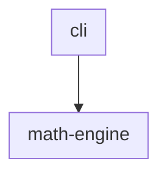
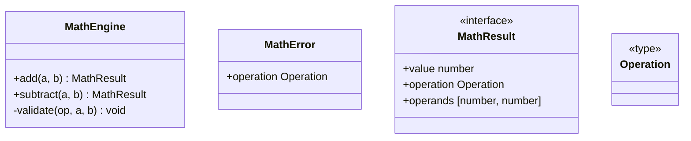

# @datalackey/update-markdown-uml

Generates and validates UML class and package diagrams for TypeScript source
trees, injecting them into Markdown documentation files.

> Status: under development

---

## What It Does

Given a TypeScript project organised into packages (one directory per
package under `src/`), this tool:

- generates a **package overview flowchart** showing cross-package
  import dependencies
- generates a **packages table** with one row per package
- generates **per-package class diagrams** showing classes, interfaces,
  and type aliases

All three sections are injected into a single Markdown file between
fixed marker pairs. Running the tool again is a no-op if nothing has
changed — output is fully deterministic.

---

## Installation

```bash
npm install --save-dev @datalackey/update-markdown-uml
```

---

## Usage

Place three marker pairs in the Markdown file where you want the diagrams
to appear:

&nbsp;&nbsp;&lt;!-- UML:packages:START --&gt;<br>
&nbsp;&nbsp;&lt;!-- UML:packages:END --&gt;

&nbsp;&nbsp;&lt;!-- UML:packages-table:START --&gt;<br>
&nbsp;&nbsp;&lt;!-- UML:packages-table:END --&gt;

&nbsp;&nbsp;&lt;!-- UML:package-details:START --&gt;<br>
&nbsp;&nbsp;&lt;!-- UML:package-details:END --&gt;

Then run:

```bash
npx update-markdown-uml README.md
```

The tool discovers `src/` automatically when it exists next to the target
Markdown file. Use `--source <path>` to override.

For CI drift detection, use `--check`:

```bash
npx update-markdown-uml --check README.md
```

---

## Options

```
update-markdown-uml [options] <file>

Options:
  --source <path>                   Override source root discovery (default: src/)
  --exclude-packages <pkg1,pkg2>    Leaf directory names to exclude from all output
  --check                           Do not write; exit non-zero if content is stale
  --verbose                         Print per-package type counts
  --quiet                           Suppress all non-error output
  --debug                           Print debug diagnostics to stderr
  --help                            Show this help message and exit
```

For full documentation of shared CLI behavior (`--check`, `--verbose`,
`--quiet`, exit codes, recursive mode) see
[Common CLI Behavior](../CLI-BEHAVIOR.md).

---

## Example

### Source tree

A simple two-package project: a `cli` layer that delegates computation to
a `math-engine` layer.

```
src/
  cli/
    AddCommand.ts
    ArgParser.ts
    CliCommand.ts
    CliRunner.ts
    CommandRegistry.ts
    ParsedArgs.ts
    SubtractCommand.ts
  math-engine/
    MathEngine.ts
    MathError.ts
    MathResult.ts
    Operation.ts
```

`cli` imports from `math-engine`. `math-engine` has no dependency on `cli`.

### Generated output

**Package overview** — one subgraph per package, arrows show import direction:



**Packages table** — names link to the class diagram section below.
Descriptions are read from an optional `_PACKAGE_INFO.md` file in each
package directory; `TBD` appears when the file is absent.

| Package | Description |
|---------|-------------|
| [cli](#cli) | TBD |
| [math-engine](#math-engine) | TBD |

**Class diagrams** — one per package, showing classes, interfaces, type
aliases, and relationships:

#### cli


#### math-engine



> **Note on `unknown` property types:** Properties initialised with a
> literal value and no explicit type annotation (e.g. `readonly name = "add"`)
> are rendered as `unknown` because the tool reads TypeScript source without
> full type resolution. Adding an explicit annotation
> (`readonly name: string = "add"`) resolves this.

---

## Built With

- [`@datalackey/tooling-core`](../tooling-core/README.md) — shared CLI framework and utilities
- [`ts-morph`](https://ts-morph.com/) — TypeScript compiler API for class and import analysis

For the full workspace tech stack see: [TECH-STACK.md](../TECH-STACK.md)
