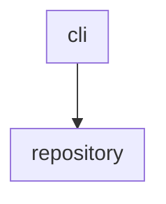

# update-markdown-uml — Design Document

<!-- TOC:START -->
- [update-markdown-uml — Design Document](#update-markdown-uml--design-document)
  - [Overview](#overview)
  - [Design Principles](#design-principles)
    - [Diagrams as Architectural Fitness Functions](#diagrams-as-architectural-fitness-functions)
    - [Progressive Disclosure](#progressive-disclosure)
    - [Convention Over Configuration](#convention-over-configuration)
  - [User-Facing API](#user-facing-api)
    - [Marker Placement](#marker-placement)
    - [Generated Output Structure](#generated-output-structure)
  - [Generated Content Detail](#generated-content-detail)
    - [Component Overview Diagram](#component-overview-diagram)
    - [Component Details Table](#component-details-table)
    - [Component Details Section](#component-details-section)
  - [Source Discovery](#source-discovery)
  - [Component Description Convention](#component-description-convention)
  - [CLI Interface](#cli-interface)
    - [`--exclude-components` / `-x`](#--exclude-components---x)
  - [Check Mode](#check-mode)
  - [Recursive Mode](#recursive-mode)
  - [Output and Summary](#output-and-summary)
    - [Default Output](#default-output)
    - [Verbose Output](#verbose-output)
    - [Quiet Output](#quiet-output)
<!-- TOC:END -->

## Overview

A CLI plugin that generates and validates UML-style class and component diagrams
for TypeScript source trees, injecting them into Markdown documentation files.

Built on the `@datalackey/tooling-core` CLI framework, following the same
conventions as `update-markdown-toc` and `nx-graph-to-mermaid`.

---

## Design Principles

### Diagrams as Architectural Fitness Functions

A diagram that is too busy to read is not a documentation problem — it is a
design signal. If the types within a subsystem cannot be rendered readably in
a single diagram, the subsystem likely has too many concerns and should be
decomposed.

This tool makes that signal visible automatically. Exclusion lists are available
as an escape hatch but are not the recommended response to a busy diagram.

### Progressive Disclosure

Consistent with the rest of this plugin ecosystem:

- Default invocation requires no configuration beyond marker placement
- Advanced options (exclusions, custom source root) are available but never forced
- `autogen-markdown-doc` integration will expose this plugin with opinionated
  defaults and no exclusion list — the unfiltered picture is intentional

### Convention Over Configuration

- Source root is discovered by convention (`src/` if present, else package root)
- Package descriptions are read from `_COMPONENT_INFO.md` in each leaf directory
- No config file required for the common case

---

## User-Facing API

### Marker Placement

The user places three marker pairs in their target Markdown file:
```markdown
<!-- UML:components:START -->
<!-- UML:components:END -->

<!-- UML:components-table:START -->
<!-- UML:components-table:END -->

<!-- UML:component-details:START -->
<!-- UML:component-details:END -->
```

That is the entire configuration surface for the default case.

### Generated Output Structure

After running the tool the target file contains:
```markdown
<!-- UML:components:START -->
(flowchart diagram — component boundary boxes with inter-component dependency arrows)
<!-- UML:components:END -->

<!-- UML:components-table:START -->
(markdown table — clickable component names and one-line descriptions)
<!-- UML:components-table:END -->

<!-- UML:component-details:START -->
(one classDiagram section per leaf directory, each with a heading)
<!-- UML:component-details:END -->
```

---

## Generated Content Detail

### Component Overview Diagram

A `flowchart TB` diagram showing:

- One `subgraph` per leaf directory under `src/`
- Each subgraph shows only the component name — type details appear in the per-component classDiagram sections
- Arrows between subgraphs where a type in one directory imports from another
- Subgraph labels are the directory names

Example:


### Component Details Table

A Markdown table immediately below the overview diagram:

| Package | Description |
|---------|-------------|
| cli | CLI parsing, plugin wiring, and help generation |
| repository | File traversal, processing orchestration, and stats |

Component names are clickable links to the corresponding component details section.
Description sourced from the first line of `_COMPONENT_INFO.md` in each leaf
directory. If absent or blank, the table shows `TBD` in the description column.
This is intentional — a visible `TBD` signals that a description is missing.
To suppress `TBD` without providing a description, create an empty
`_COMPONENT_INFO.md` with a blank first line.

### Component Details Section

One `classDiagram` per leaf directory, generated by ts-morph, injected
as a sequence of headed sections within the `UML:component-details` marker pair:
```markdown
#### cli
\`\`\`mermaid
classDiagram
  direction TB
  ...
\`\`\`

#### repository
\`\`\`mermaid
classDiagram
  direction TB
  ...
\`\`\`
```

---

## Source Discovery

| Convention | Behavior |
|------------|----------|
| `src/` exists | Used as source root |
| No `src/` | Package root used directly |
| `--source <path>` | Overrides discovery |

Leaf directories are all directories under the source root that contain
at least one `.ts` file (excluding `*.spec.ts` and `*.test.ts`).

---

## Component Description Convention

Each leaf directory may contain `_COMPONENT_INFO.md`. The underscore prefix:

- Forces lexicographic sort to top of directory listing in IDEs
- Clearly signals metadata rather than source

The plugin reads the first line of this file as the table description.
The remainder of the file may contain extended notes, design rationale,
or known limitations — preserved for human readers, ignored by the plugin.

Priority order:

1. First line of `_COMPONENT_INFO.md` in leaf directory
2. `TBD` — visible signal that a description is missing. Plugin documentation will mention that in order  to suppress 
   this message an empty `_COMPONENT_INFO.md` file must be created with a blank first line.

---

## CLI Interface
```
update-markdown-uml [options] <markdownFile>
```

Inherits all standard options from `tooling-core`:
`--check`, `--verbose`, `--quiet`, `--debug`, `--help`, `--version`

Plugin-specific options:

| Flag | Short | Description |
|------|-------|-------------|
| `--source <path>` | `-s` | Override source root discovery |
| `--exclude-components <names>` | `-x` | Comma-separated leaf directory names to exclude from all diagram output |
| `--no-properties` | | Omit property types from class diagrams |
| `--no-modifiers` | | Omit visibility modifiers from class diagrams |

Short flags are provided for options used in everyday invocation (`-s`, `-x`).
Cosmetic toggles (`--no-properties`, `--no-modifiers`) are long-form only.

### `--exclude-components` / `-x`

Accepts a comma-separated list of component names (directory names, not paths).
Excluded components are omitted from the overview diagram, the details table,
and the component details section.

If a name in the exclude list does not correspond to any directory found under
the source root, a warning is printed. The warning is suppressed when
`--quiet` is active.
---

## Check Mode

Consistent with `update-markdown-toc`: byte-for-byte comparison of current
file content against generated output. Each marker region is compared
independently — stale reporting identifies which specific region has drifted
rather than just that the file differs overall. Any stale region causes a
non-zero exit.

---

## Recursive Mode

This plugin operates in single-file mode only. UML component and class diagrams
are dense architectural artifacts — they belong in one designated location
per source tree, not distributed across multiple files. `--recursive` is
explicitly rejected with an error.

If the same diagrams need to appear in more than one document, the recommended
approach is to define separate CLI invocations, one per target file, as
distinct build tasks. This keeps each injection explicit and auditable.

---
## Output and Summary

### Default Output

Unless `--quiet` is active, a single summary line is always printed after
a successful run:
```
update-markdown-uml: 6 components, 23 types, 4 inter-component dependencies
```

### Verbose Output

When `--verbose` is active, a per-component breakdown is printed before the
summary line, sorted by type count descending:
```
  markdown     — 8 types
  cli          — 5 types
  repository   — 4 types
  logging      — 2 types
  policy       — 3 types
  util         — 1 type
update-markdown-uml: 6 components, 23 types, 4 inter-component dependencies
```

Sorting by type count descending makes the heaviest components immediately
visible at the top. A component that grows noticeably from run to run is a
passive signal that the subsystem may be accumulating too many concerns —
consistent with the architectural fitness function principle of this tool.

### Quiet Output

When `--quiet` is active, no output is printed. Exit codes still reflect
success or failure.
---


