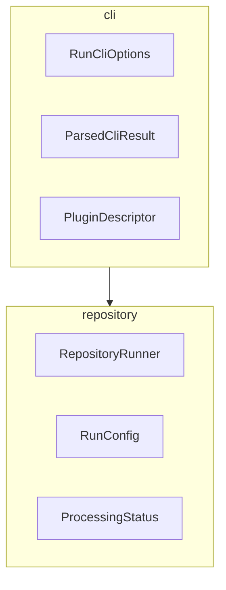

# update-markdown-uml — Design Document

<!-- TOC:START -->
<!-- TOC:END -->

## Overview

A CLI plugin that generates and validates UML-style class and package diagrams
for TypeScript source trees, injecting them into Markdown documentation files.

Built on the `@datalackey/tooling-core` CLI framework, following the same
conventions as `update-markdown-toc` and `nx-graph-to-mermaid`.

---

## Design Principles

### Diagrams as Architectural Fitness Functions

A diagram that is too busy to read is not a documentation problem — it is a
design signal. If the types within a subsystem cannot be rendered readably in
a single diagram, the subsystem likely has too many concerns and should be
decomposed.

This tool makes that signal visible automatically. Exclusion lists are available
as an escape hatch but are not the recommended response to a busy diagram.

### Progressive Disclosure

Consistent with the rest of this plugin ecosystem:

- Default invocation requires no configuration beyond marker placement
- Advanced options (exclusions, custom source root) are available but never forced
- `autogen-markdown-doc` integration will expose this plugin with opinionated
  defaults and no exclusion list — the unfiltered picture is intentional

### Convention Over Configuration

- Source root is discovered by convention (`src/` if present, else package root)
- Package descriptions are read from `_PACKAGE_INFO.md` in each leaf directory
- No config file required for the common case

---

## User-Facing API

### Marker Placement

The user places three marker pairs in their target Markdown file:
```markdown
<!-- UML:packages:START -->
<!-- UML:packages:END -->

<!-- UML:packages-table:START -->
<!-- UML:packages-table:END -->

<!-- UML:package-details:START -->
<!-- UML:package-details:END -->
```

That is the entire configuration surface for the default case.

### Generated Output Structure

After running the tool the target file contains:
```markdown
<!-- UML:packages:START -->
(flowchart diagram — package boundary boxes with inter-package dependency arrows)
<!-- UML:packages:END -->

<!-- UML:packages-table:START -->
(markdown table — clickable package names and one-line descriptions)
<!-- UML:packages-table:END -->

<!-- UML:package-details:START -->
(one classDiagram section per leaf directory, each with a heading)
<!-- UML:package-details:END -->
```

---

## Generated Content Detail

### Package Overview Diagram

A `flowchart TB` diagram showing:

- One `subgraph` per leaf directory under `src/`
- Each subgraph contains the names of the types/classes/interfaces in that directory
- Arrows between subgraphs where a type in one directory imports from another
- Subgraph labels are the directory names

Example:


### Package Details Table

A Markdown table immediately below the overview diagram:

| Package | Description |
|---------|-------------|
| cli | CLI parsing, plugin wiring, and help generation |
| repository | File traversal, processing orchestration, and stats |

Package names are clickable links to the corresponding package details section.
Description sourced from the first line of `_PACKAGE_INFO.md` in each leaf
directory. If absent or blank, the table shows `TBD` in the description column.
This is intentional — a visible `TBD` signals that a description is missing.
To suppress `TBD` without providing a description, create an empty
`_PACKAGE_INFO.md` with a blank first line.

### Package Details Section

One `classDiagram` per leaf directory, generated by tsuml2, injected
as a sequence of headed sections within the `UML:package-details` marker pair:
```markdown
#### cli
\`\`\`mermaid
classDiagram
  direction TB
  ...
\`\`\`

#### repository
\`\`\`mermaid
classDiagram
  direction TB
  ...
\`\`\`
```

---

## Source Discovery

| Convention | Behavior |
|------------|----------|
| `src/` exists | Used as source root |
| No `src/` | Package root used directly |
| `--source <path>` | Overrides discovery |

Leaf directories are all directories under the source root that contain
at least one `.ts` file (excluding `*.spec.ts` and `*.test.ts`).

---

## Package Description Convention

Each leaf directory may contain `_PACKAGE_INFO.md`. The underscore prefix:

- Forces lexicographic sort to top of directory listing in IDEs
- Clearly signals metadata rather than source

The plugin reads the first line of this file as the table description.
The remainder of the file may contain extended notes, design rationale,
or known limitations — preserved for human readers, ignored by the plugin.

Priority order:

1. First line of `_PACKAGE_INFO.md` in leaf directory
2. `TBD` — visible signal that a description is missing. Plugin documentation will mention that in order  to suppress 
   this message an empty `_PACKAGE_INFO.md` file must be created with a blank first line.

---

## CLI Interface
```
update-markdown-uml [options] <markdownFile>
```

Inherits all standard options from `tooling-core`:
`--check`, `--verbose`, `--quiet`, `--debug`, `--help`

Plugin-specific options:

| Flag | Short | Description |
|------|-------|-------------|
| `--source <path>` | `-s` | Override source root discovery |
| `--exclude-packages <names>` | `-x` | Comma-separated leaf directory names to exclude from all diagram output |
| `--no-properties` | | Omit property types from class diagrams |
| `--no-modifiers` | | Omit visibility modifiers from class diagrams |

Short flags are provided for options used in everyday invocation (`-s`, `-x`).
Cosmetic toggles (`--no-properties`, `--no-modifiers`) are long-form only.

### `--exclude-packages` / `-x`

Accepts a comma-separated list of package names (directory names, not paths).
Excluded packages are omitted from the overview diagram, the details table,
and the package details section.

If a name in the exclude list does not correspond to any directory found under
the source root, a warning is printed. The warning is suppressed when
`--quiet` is active.
---

## Check Mode

Consistent with `update-markdown-toc`: byte-for-byte comparison of current
file content against generated output. Each marker region is compared
independently — stale reporting identifies which specific region has drifted
rather than just that the file differs overall. Any stale region causes a
non-zero exit.

---

## Recursive Mode

This plugin operates in single-file mode only. UML package and class diagrams
are dense architectural artifacts — they belong in one designated location
per source tree, not distributed across multiple files. `--recursive` is
explicitly rejected with an error.

If the same diagrams need to appear in more than one document, the recommended
approach is to define separate CLI invocations, one per target file, as
distinct build tasks. This keeps each injection explicit and auditable.

---
## Output and Summary

### Default Output

Unless `--quiet` is active, a single summary line is always printed after
a successful run:
```
update-markdown-uml: 6 packages, 23 types, 4 inter-package dependencies
```

### Verbose Output

When `--verbose` is active, a per-package breakdown is printed before the
summary line, sorted by type count descending:
```
  markdown     — 8 types
  cli          — 5 types
  repository   — 4 types
  logging      — 2 types
  policy       — 3 types
  util         — 1 type
update-markdown-uml: 6 packages, 23 types, 4 inter-package dependencies
```

Sorting by type count descending makes the heaviest packages immediately
visible at the top. A package that grows noticeably from run to run is a
passive signal that the subsystem may be accumulating too many concerns —
consistent with the architectural fitness function principle of this tool.

### Quiet Output

When `--quiet` is active, no output is printed. Exit codes still reflect
success or failure.
---

## Planned Tooling Core Contributions

### `findMarker` and `findMarkers`

The current `injectBetweenMarkers` utility operates on a single marker pair
and returns a full updated string. It has no facility for reporting where
markers are located, and does not support multiple distinct marker pairs in
one file.

This plugin requires both capabilities — three separate marker pairs are
injected into a single target file, and check mode must be able to report
which specific region is stale.

The following utilities should be contributed to `tooling-core` prior to or
during implementation of this plugin:
```typescript
export interface MarkerLocation {
  startMarker: string
  endMarker: string
  startLine: number
  endLine: number
  startIndex: number
  endIndex: number
}

/**
 * Locates a single marker pair within a content string.
 * Returns null if either marker is not found or if end precedes start.
 */
export function findMarker(
  content: string,
  startMarker: string,
  endMarker: string
): MarkerLocation | null

/**
 * Locates multiple named marker pairs in a single pass over the content.
 * Returns a map keyed by startMarker string.
 * Markers not found in the content are absent from the result map.
 */
export function findMarkers(
  content: string,
  pairs: Array<{ startMarker: string; endMarker: string }>
): Map<string, MarkerLocation>
```

`findMarker` is a general-purpose utility applicable to any plugin that needs
to locate or report on marker positions without necessarily replacing their
content. It has no dependency on UML-specific behavior and belongs in the
core library.

### `injectSections`

Inject a collection of named headed sections as a single block between one
marker pair. Generalizes `injectBetweenMarkers` for the case where multiple
sub-sections must be written inside a single outer marker region.

---

## Refactor Candidates

Once `findMarker` is implemented and tested in `tooling-core`, the following
existing code should be refactored to use it. These are not blocking for the
UML plugin but represent cleanup that improves consistency and error quality
across the ecosystem.

**`tooling-core/src/markdown/injectBetweenMarkers.ts`**

Current ad-hoc index checks should be replaced with a call to `findMarker`,
propagating the returned `MarkerLocation` or throwing a consistent error with
line numbers if `findMarker` returns `null`.

**`update-markdown-toc/src/engine/generateToc.ts`**

Current ad-hoc presence checks should be replaced with `findMarker`, which
handles all three error cases and additionally surfaces line numbers for more
actionable error output:
```
ERROR: path/to/file.md:4: TOC start delimiter found without matching end
```

Benefits of consolidation:

- Single well-tested detection implementation across all plugins
- Consistent error message format
- Line numbers surfaced in all marker-related errors
- Eliminates the silent `endIndex <= startIndex` case in `injectBetweenMarkers`
  which currently produces a confusing generic error rather than identifying
  the reversed-marker condition explicitly

---

## Dependencies

| Package | Role |
|---------|------|
| `tsuml2` | Generates `classDiagram` Mermaid DSL from TypeScript source |
| `ts-morph` | TypeScript compiler API — discovers types, resolves imports for package-level dependency analysis |
| `@datalackey/tooling-core` | CLI framework, file processing, injection utilities |

---

## Out of Scope (v1)

- `autogen-markdown-doc` integration — deferred to a subsequent release
- Cross-package type-level relationship arrows in the overview diagram
- Recursive repository traversal — one source tree and one injection target per invocation
- Auto-generation of `_PACKAGE_INFO.md` files
- Per-type exclusion in `autogen-markdown-doc` integration
- Diagram caching or incremental regeneration

---

## Open Questions

1. tsuml2 vs ts-morph for leaf diagram generation — tsuml2 is simpler to
   integrate but ts-morph gives more control over output. Revisit after
   evaluating tsuml2 output quality against a real package.