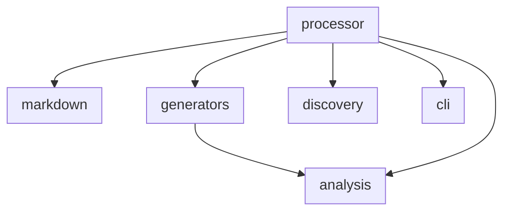
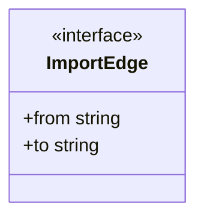
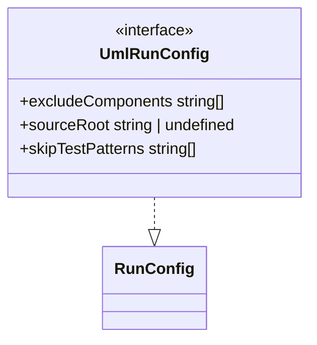
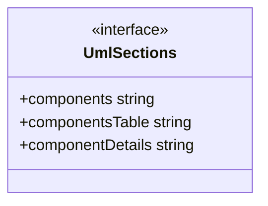
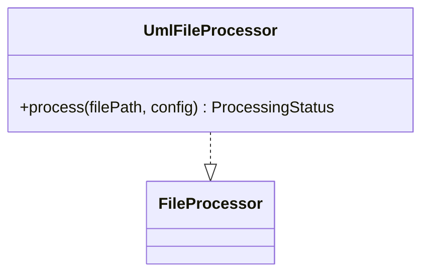

# Contributing to @datalackey/update-markdown-uml

For workspace-level setup, build pipeline, and release workflow see:
[javascript/docs/CONTRIBUTING.md](../../docs/CONTRIBUTING.md)

---

## Code Structure Diagrams

### Component Diagram

<!-- UML:components:START -->

<!-- UML:components:END -->

### Components Table

<!-- UML:components-table:START -->
| Component | Description |
|-----------|-------------|
| [analysis](#analysis) | TypeScript import analysis: uses `ts-morph` to walk source files across leaf directories and collect directed cross-leaf import edges, which become the dependency arrows in generated component diagrams |
| [cli](#cli) | Plugin wiring for `update-markdown-uml`: declares the `PluginDescriptor` with `--source` and `--exclude-components` flags, `UmlRunConfig` type, option parsing, and config validation |
| [discovery](#discovery) | Leaf component discovery: locates subdirectories under a source root that contain qualifying `.ts` files, and reads their `_COMPONENT_INFO.md` descriptions for use in diagram table rows |
| [generators](#generators) | Diagram and table generators: builds the Mermaid flowchart (component overview with dependency arrows), per-component Mermaid class diagrams, and the Markdown summary table from discovered components and import edges |
| [markdown](#markdown) | UML section injection: locates and replaces the three managed UML marker blocks (`UML:components`, `UML:components-table`, `UML:component-details`) within a target Markdown file |
| [processor](#processor) | Top-level `UmlFileProcessor`: orchestrates the full UML update pipeline — source root resolution, leaf discovery, import analysis, diagram generation, and Markdown injection — for a single target file |
<!-- UML:components-table:END -->

### Component Details

<!-- UML:component-details:START -->
#### analysis

#### cli

#### discovery
| Function | Parameters | Returns | Description |
|----------|------------|---------|-------------|
| `discoverLeafComponents` | sourceRoot: string skipTestPatterns: string[] onWarn: (message: string) => void | string[] | Discovers leaf component directories under sourceRoot. |
| `readComponentDescription` | leafDir: string onWarn: (message: string) => void | string \| undefined | Reads the first sentence (ending with '. |

#### generators
| Function | Parameters | Returns | Description |
|----------|------------|---------|-------------|
| `buildComponentClassDiagram` | leafDir: string warn: (msg: string) => void | string | Builds a Mermaid classDiagram block for a single leaf component directory. |
| `buildComponentsFlowchart` | components: string[] edges: ImportEdge[] | string | Builds a Mermaid flowchart TB diagram showing leaf components as compact subgraphs with inter-component import dependency arrows. |
| `buildComponentsTable` | components: string[] descriptions: Map<string, string \| undefined> | string | Builds a Markdown table listing leaf components and their descriptions. |

#### markdown

#### processor

<!-- UML:component-details:END -->

